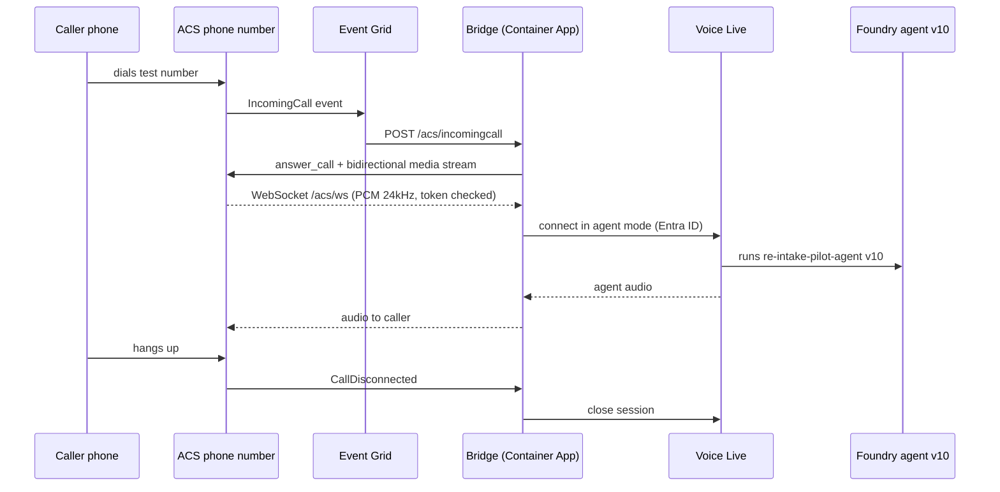

# Telephony Bridge Spec — Pilot (Steps 3 & 4)

> **For Claude Code:** This is your build brief. Read it fully before starting. Build only what is here; anything under "Do not build" needs Raghu's approval first. The source of truth is the "Telephony Bridge Spec" tab of the RE AI Voice Agent doc — if this file and the doc differ, ask.

Sep 23, 2026 · Raghu Akula

This spec tells Claude Code exactly what to build so a real phone call reaches the `re-intake-pilot-agent` (Alex, v10) in Azure AI Foundry — and nothing more. It is scoped for the pilot, but the bridge is built client-agnostic so the same code serves every future Hireastra voice agent.

## 1. Goal and pilot success definition

The pilot succeeds when Raghu dials a test phone number from his own mobile and holds a full intake conversation with Alex, with the transcript visible in Foundry Traces for agent version 10.

In scope: one test number, one concurrent call, inbound only, English, no calendar booking. Target agent: `re-intake-pilot-agent` in Foundry project `hireastra` on resource `hireastra-resource` (resource group `rg-hireastra`).

Out of scope: calendar tools (separate spec), outbound calls, Canadian production number, more than one caller at a time.

## 2. Prerequisites and a blocker to clear first

**Blocker:** Microsoft's Canada and US number pages list Microsoft for Startups and sponsorship subscriptions as reviewed case by case, and state numbers cannot be bought with free credits. Our Foundry work runs on Microsoft for Startups credits, so step 2 (buying the number) may be refused on that subscription.

| Option | What it takes | Trade-off |
| --- | --- | --- |
| A. Request eligibility | Raghu files a ticket at Microsoft's PSTN support portal for the credits subscription | Keeps everything in one subscription; unknown wait |
| B. Separate pay-as-you-go subscription for ACS only (recommended) | Raghu creates a card-billed subscription in the same tenant; ACS and the number live there, the agent stays on credits | Fastest all-Microsoft path; a small card charge for the number and minutes |
| C. Twilio number | Card-billed Twilio account; the accelerator supports Twilio natively | Instant, but call audio leaves the Azure boundary; fine for a test, revisit for production |

Recommendation: start A today (it costs nothing), use B for the pilot so we don't wait on it. The bridge is built provider-agnostic, so the choice doesn't change the code.

Other prerequisites before Claude Code starts:

- [ ] Provider decision (A/B/C) — Raghu
- [ ] ACS resource created and test number acquired (steps 1–2) — Cowork drives, Raghu approves the purchase
- [ ] Region of `hireastra-resource` confirmed, since the bridge must deploy alongside it — Cowork
- [ ] Private GitHub repo `VoiceAgentPilot` created — done (https://github.com/AmRaghuAkula/VoiceAgentPilot)
- [ ] Raghu signed in with `az login` and `azd auth login` on the machine running Claude Code

## 3. Architecture

The bridge only moves audio and call events. Everything Alex says and how she behaves stays in Foundry, so a prompt fix in the portal reaches the phone line without redeploying the bridge.

## 4. Reuse boundary

The rule for Claude Code: no real-estate words, agent names or phone numbers in code. Anything client-specific is config.

| Layer | Contents | Changes per client? |
| --- | --- | --- |
| Generic bridge (code) | ACS call answering, media WebSocket, Voice Live session, barge-in, hang-up handling, fallback message, logging, call-length cap | No — reused by every vertical |
| Routing config (JSON) | Called number → Foundry project, agent name, pinned agent version | Yes — one entry per client number |
| Agent behaviour (Foundry portal) | Instructions, voice, speech settings, guardrails | Yes — lives in Foundry, never in the bridge |

The pilot routing config has one entry. Going multi-client later means adding entries, not code.

## 5. Step 3 — Build the bridge (instructions for Claude Code)

**Starting point:** Microsoft's Call Center Voice Agent Accelerator (Python, deployed with `azd` to Azure Container Apps). Import it into the private repo [`VoiceAgentPilot`](https://github.com/AmRaghuAkula/VoiceAgentPilot) — import, not fork, because a GitHub fork of a public repo cannot be private. Add the original as an `upstream` remote so Microsoft's fixes can be pulled later. Keep our changes in as few files as possible so those pulls stay clean.

**Modifications, in order:**

1. **Switch Voice Live from model mode to agent mode.** First check how the current accelerator version supports agent mode. If it does, use it; if not, connect with the `azure-ai-voicelive` SDK's `connect()` using `agent_name`, `project_name` and `agent_version`, per Microsoft's Voice Live agents quickstart. Agent mode accepts Entra ID only — use `DefaultAzureCredential` (the Container App's managed identity), never a key. Use the GA `api_version` if it supports agent mode; otherwise the newest preview, and record which one in the README.
2. **Pin the agent version.** Connect to version `10` explicitly, never "latest". A portal edit must not silently change what callers hear; moving the phone line to a new version is a deliberate config change.
3. **Do not override agent behaviour in `session.update`.** No instructions, no voice, no VAD settings from the bridge. Foundry is the single source of truth. Only exception: if acceptance test 4 shows the portal's Interim Response setting (2500 ms threshold, LLM-generated) is not carried through agent metadata, set `interim_response` explicitly in `session.update` from config, and note it in the README.
4. **Add number-based routing.** Read the called number (`to`) from the IncomingCall event and look it up in `AGENT_ROUTING_JSON`. No match: answer, play the fallback message, hang up, log it. One entry for the pilot.
5. **Secure the media WebSocket.** Put a random token (from Key Vault) in the media streaming transport URL and reject `/acs/ws` connections without it. Handle the Event Grid subscription validation handshake on `/acs/incomingcall`.
6. **Cap call length.** End the call after `MAX_CALL_SECONDS` (pilot: 600) with a short spoken goodbye. Guards cost against the kind of 6-minute runaway conversation we saw in testing.
7. **Fallback on failure.** If Voice Live fails to connect or drops mid-call, play `FALLBACK_MESSAGE` via ACS text-to-speech and hang up cleanly. Never leave the caller in silence.
8. **Close cleanly on hang-up.** On `CallDisconnected`, close the Voice Live session within 5 seconds so we aren't billed for dead sessions.
9. **Logging.** Keep the accelerator's per-call `cid`; also log the Voice Live conversation ID so a phone call can be matched to its Foundry trace. Mask caller numbers to the last 4 digits in all logs (Canadian privacy expectations under PIPEDA).
10. **Ambient audio off:** `AMBIENT_PRESET=none`.

Everything else (audio format conversion, barge-in, media streaming) is reused from the accelerator unchanged.

## 6. Step 4 — Deploy

**Where:** a new resource group `rg-hireastra-voice-pilot`, in the same region as `hireastra-resource`. A separate group isolates cost and makes teardown one delete. Under option B it sits in the new pay-as-you-go subscription; the agent stays where it is.

**Infra changes to the accelerator's Bicep:** it must not create its own AI Services/Speech resource — point at the existing `hireastra-resource` through parameters. One AI resource only.

| Resource | Setting | Why |
| --- | --- | --- |
| Container App | min replicas 1, max 1; external HTTPS ingress; system-assigned managed identity | Min 1 prevents a cold start missing the call-answer window; max 1 is enough for one caller |
| Managed identity role | **Foundry User** on `hireastra-resource` (formerly "Azure AI User") | Required for Voice Live agent mode; Raghu approves (needs Owner or User Access Administrator) |
| Key Vault | holds ACS connection string and media WebSocket token; identity gets Key Vault Secrets User | ACS doesn't support managed identity, so its connection string must be a protected secret |
| Event Grid | system topic on the ACS resource; subscription for `Microsoft.Communication.IncomingCall` filtered to the test number, pointing at `https://<app>/acs/incomingcall` | Only our number triggers the bridge |
| Monitoring | Container App logs to Log Analytics; Application Insights connection to `hireastra-appinsights-0257` | Bridge and agent traces in one place |
| Budget alert | on `rg-hireastra-voice-pilot` (suggest $50/month) — Raghu sets | Early warning on runaway spend |

**Config reference** (names are ours; keep the accelerator's own variables for anything not listed):

| Variable | Pilot value | Secret? |
| --- | --- | --- |
| `VOICE_LIVE_ENDPOINT` | endpoint of `hireastra-resource` (confirm exact URL in portal) | No |
| `AGENT_ROUTING_JSON` | `{"<test number>": {"project": "hireastra", "agent": "re-intake-pilot-agent", "version": "10"}}` | No |
| `MAX_CALL_SECONDS` | `600` | No |
| `FALLBACK_MESSAGE` | "Sorry, we're having trouble right now. Please call back in a few minutes." | No |
| `AMBIENT_PRESET` | `none` | No |
| `ACS_CONNECTION_STRING` | from Key Vault | Yes |
| `MEDIA_WS_TOKEN` | random 32+ characters, from Key Vault | Yes |

Deploy with `azd up`; redeploy code with `azd deploy`. Never commit `.env` files or secrets.

## 7. Do not build

Claude Code should stop and ask Raghu before doing any of these:

- Calendar or booking tools, or any OpenAPI tool wiring (separate spec)
- Outbound calling
- A new web UI (the accelerator's browser client can stay for debugging)
- Custom speech-to-text or text-to-speech — Voice Live does this
- Re-implementing audio handling or barge-in — reuse the accelerator's
- Configuring a second telephony provider (leave that code in place, unused)
- Autoscaling, multi-region or high-availability setup
- Storing transcripts or caller data anywhere outside Foundry traces and logs
- Changing the agent's instructions, voice or speech settings from the bridge

## 8. Acceptance tests

Raghu calls the test number from his mobile; Cowork pulls the matching Foundry trace and logs for each test.

- [ ] 1. **Connects:** Alex greets within 3 seconds of the call being answered
- [ ] 2. **Full intake:** a 2-minute buyer conversation completes; the transcript appears in Foundry Traces under agent version 10, matched by conversation ID in the bridge logs
- [ ] 3. **Barge-in:** interrupting Alex mid-sentence stops her speech and she responds to the interruption
- [ ] 4. **Filler timing:** no "let me check" filler on fast replies (confirms the 2500 ms Interim Response setting reached the phone line; if not, apply modification 3's exception)
- [ ] 5. **Speech accuracy on a phone line:** repeat the "buying" / "bye" script and a 10-digit phone number; Alex confirms the ambiguous word and reads the number back correctly
- [ ] 6. **Hang-up:** after Raghu hangs up, the bridge logs show the Voice Live session closed within 5 seconds
- [ ] 7. **Failure path:** with a deliberately wrong agent version in config, the caller hears the fallback message and the call ends cleanly
- [ ] 8. **Call cap:** with `MAX_CALL_SECONDS` temporarily set to 60, the call ends with a goodbye at one minute
- [ ] 9. **Latency baseline:** record average per-turn response time from Traces and compare with the ~5.9 s browser baseline from Stage 0

The pilot passes when 1–8 pass. Test 9 is a measurement, not pass/fail.

## 9. Risks and who does what

| Risk | Mitigation |
| --- | --- |
| Credits subscription can't buy a number | Option B (pay-as-you-go subscription for ACS only); file the eligibility ticket in parallel |
| Phone audio is lower quality than the browser, so speech recognition gets worse (more "bye/buy" errors) | Acceptance test 5; if it fails, enable Azure Speech Phrase list with real-estate terms before anything else |
| Telephony adds latency on top of the ~5.9 s baseline | Measure in test 9; the Interim Response filler covers slow turns |
| Alex can't hang up the phone herself | Caller hangs up in the pilot; an "end call" tool is a production item |
| Agent-mode API may still be in preview | Pin the API version, record it in the README, re-check before production |
| Accelerator is sample code, not audited (Microsoft states it isn't SOC 1/2 audited) | Fine for a pilot; production needs our own security review |
| Wrong region pairing adds latency or fails | Confirm `hireastra-resource` region before deploying |

| Who | Does |
| --- | --- |
| Raghu | Provider decision; creates subscription (option B) and GitHub repo; approves number purchase and role assignments; signs in to Azure for Claude Code; places test calls |
| Cowork (Claude) | Steps 1–2 in the portal; region check; verifies role assignments; pulls traces and logs after each test |
| Claude Code | Steps 3–4: import the accelerator, make modifications 1–10, infra changes, deploy, fix failures from acceptance tests |

**Toward production (not now):** the same bridge gets more routing entries, an "end call" tool, caller-ID passed to the agent so returning callers aren't asked for their number, a Canadian number, higher replica counts and a security review. None of these require rewriting what the pilot builds.

## 10. Sources

- [Call Center Voice Agent Accelerator (GitHub)](https://github.com/Azure-Samples/call-center-voice-agent-accelerator)
- [Voice Live telephony integration](https://learn.microsoft.com/en-us/azure/ai-services/speech-service/voice-live-telephony)
- [Voice Live agents quickstart (agent mode, Entra ID, Foundry User role)](https://learn.microsoft.com/en-us/azure/ai-services/speech-service/voice-live-agents-quickstart)
- [Function calling in a Voice Live session](https://learn.microsoft.com/en-us/azure/ai-services/speech-service/how-to-voice-live-function-calling)
- [ACS phone numbers — Canada eligibility](https://learn.microsoft.com/en-us/azure/communication-services/concepts/numbers/phone-number-management-for-canada)
- [ACS phone numbers — United States eligibility](https://learn.microsoft.com/en-us/azure/communication-services/concepts/numbers/phone-number-management-for-united-states)
