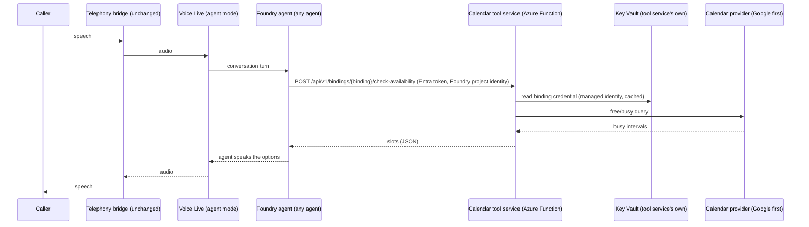

# Calendar Booking Tools — Design (agent-agnostic, provider-agnostic)

Date: 2026-09-29 · Status: **rev 3.2 (2026-10-01, UC01-F: UC01 follow-ups, Q-075 item 1, D-059; plus the reason-code requirement learned on the SMS track).** Rev 3.1 was FOUNDER-ACCEPTED (2026-09-29, "spec approved"). Rev 3.2 records what UC01 verified and tightens §10's logging rule; it changes no contract, schema, binding model or claim-store behaviour.

Review history:
- A partner self-review of rev 1.
- Round 1 (rev 1): NOT READY.
- Round 2 (rev 2), two independent Opus reviewers: both NOT READY.
- Round 3 (rev 3): **READY WITH FIXES, with no blocking findings.** All of round 3's findings are applied in rev 3.1.
- Rev 3.2: the UC01-F docs unit's Opus docs review (D-013).

See §17.

Source requirements:
- [`docs/calendar-handoff-to-claude-code-2026-09-28.md`](../../calendar-handoff-to-claude-code-2026-09-28.md) — the original handoff (call flow, locked decisions).
- [`docs/calendar-booking-scoped-definition-2026-09-29.md`](../../calendar-booking-scoped-definition-2026-09-29.md) — the scoped definition, plus the partner's five unactioned review notes (all five are resolved in this spec; see §16).
- Founder instructions, 2026-09-29, two rounds: (1) decouple from the bridge and from any one calendar provider; (2) **build a reusable component that works across agents, or an agent library, not tied to any specific agent.**

Governance context: [CLAUDE.md](../../../CLAUDE.md), [DECISIONS.md](../../DECISIONS.md) (especially D-004, D-006, D-021, D-030, D-034, D-049), [TELEPHONY_BRIDGE_SPEC.md](../../../TELEPHONY_BRIDGE_SPEC.md) §4 (reuse boundary) and §7 (do not build).

---

## 0. Framing: correctness over the date (read this first)

**The Wednesday 2026-09-30 EOD gate in both source documents is withdrawn.** The founder was asked directly whether to keep pushing for that date given the larger, agent-agnostic scope, and chose to relax it. Friday's demo (2026-10-02) runs the already-built callback-only flow, which carries no risk. Nothing in this design is shaped to hit a date. Where a faster path would weaken the agent-agnostic or provider-agnostic properties, this spec takes the slower path on purpose. Anyone reading this later should not mistake speed for a requirement.

**Recommended consequence:** nothing in this track touches the live production agent before the Friday demo has finished (see Q-068). All development and testing before then uses a separate test agent.

---

## 1. What this is, in one paragraph

A small HTTP service, the **calendar tool service**, exposes two operations to AI agents: `check_availability` and `book_appointment`. Any agent that can call an OpenAPI tool can use it. The first consumer is a Foundry voice agent reached through Voice Live, but nothing in the service knows that. Which calendar an agent reads and writes, whose name is on the booking, the bookable hours, the meeting length and the appointment types all come from a per-deployment **binding** (configuration). Which calendar *vendor* is behind a binding comes from a **provider adapter**, and Google Calendar is the first one. Adding a second agent means adding a binding and wiring the tool. Adding Microsoft or Apple calendars means writing one adapter module that passes a shared conformance suite. Neither requires changing the core code or the deployed infrastructure.

---

## 2. Scope

**In scope**
- The generic tool contract (OpenAPI 3.0) for `check_availability` and `book_appointment` (§5).
- The binding model and how a request is bound to exactly one calendar (§4).
- The provider-adapter interface, and the Google Calendar adapter as its first implementation (§6, §8).
- Credentials: Google OAuth consent capture, Key Vault storage, server-side refresh (§8.3, §9).
- Hosting: an Azure Function, separate from the telephony bridge, with managed identity and Entra-authenticated callers (§9).
- Wiring the tool to a Foundry agent, first a test agent, then the demo agent (§11).
- Failure modes, the test plan with the live-call acceptance gate, and the unit breakdown (§12–§14).

**Out of scope (future siblings, not v1)**
- Cancelling or rescheduling. A caller-facing cancel needs caller authentication, which a phone-number fingerprint does not provide. Deliberately excluded.
- SMS or email confirmations (parked in the handoff). v1 creates no attendees and sends no invitations.
- Location handling for in-person meetings (handoff: "no location handling").
- Checking free/busy across several calendars per binding, round-robin across hosts, or resource booking. The binding model leaves room for these (§4.4), but v1 does not build them.
- Outbound calling, and anything else in TELEPHONY_BRIDGE_SPEC.md §7 that this spec does not explicitly lift (§15.3).
- **Any change to the telephony bridge (`server/`).** The bridge is not in the tool-call path at all (§3).

---

## 3. Architecture



Key properties:

1. **The bridge is not in the path.** Foundry calls the tool service directly, server-side, through its OpenAPI tool mechanism. The bridge keeps moving audio only. This spec has no dependency on where the bridge runs, and no code in `server/` changes. **This depends on Voice Live agent mode running a Foundry agent's OpenAPI tools server-side, which is not yet verified**. It is the first thing the build verifies (UC01, §14), and the whole design stops there if it's false (§3.1). **Rev 2:** UC01 tests OpenAPI and MCP side by side, and whichever works is the primary transport.
2. **Three layers, mirroring the bridge's own reuse boundary** (TELEPHONY_BRIDGE_SPEC.md §4):

   | Layer | Contents | Changes per agent / client? |
   | --- | --- | --- |
   | Generic tool service (code) | Tool contract, slot engine, booking algorithm, provider adapters, auth checks, logging | No. Reused by every agent |
   | Bindings (config) | Binding ID → provider, calendar, credential secret name, timezone, hours, durations, appointment types, host display name, allowed callers | Yes. One entry per agent–calendar pairing |
   | Agent behavior (Foundry) | When to offer a booking, how to read times back, what to say on failure (for example a callback promise), persona | Yes. Lives in each agent's Foundry instructions, never in the tool service |

3. **The core is framework-free.** `core/` imports neither Azure Functions nor any provider SDK. The HTTP layer (Azure Functions) and the provider adapters are thin shells around it. A test enforces this (§13, test G1). This is what lets the same core be hosted differently later (a Container App, or an MCP facade for agents that prefer MCP), without a rewrite.

### 3.1 If UC01's feasibility check fails

**Rev 2 (S4): OpenAPI and MCP are co-equal candidates, and UC01 tests both.** A Microsoft voice-agent write-up describes MCP tools running server-side in the voice orchestrator, and it does not say the same about OpenAPI tools. The Voice Live FAQ says MCP works with Foundry (new) agents, not classic ones. Voice Live MCP needs `api_version` 2026-04-10 or later, which the bridge's configured version meets. Whichever transport UC01 proves to work becomes the primary transport. The other is a thin sibling shell over the same core (§3 property 3), so the choice doesn't touch the core, the bindings or the adapters. One consequence to note: an MCP transport might also carry a per-agent identity for published agents (§4.2 option C), which could make agent-level authorization possible later.

If **neither** transport runs in a Voice Live agent-mode session:
- (a) Revisit with Microsoft support or the docs before anything else.
- (b) Function tools executed by the bridge. **Rejected in advance as a default.** It would put calendar logic in the bridge's call path, which contradicts the founder's decoupling requirement. It would need a founder decision.

Whichever applies, the partner revises this spec before any core unit (UC02 onward) starts.

---

## 4. The agent-agnostic mechanism: bindings

### 4.1 What a binding is

A **binding** is one named pairing of "an agent (or group of agents) that may use this" with "one calendar, one credential, one set of booking rules". It is the only place anything agent-specific, business-specific or person-specific lives.

```json
{
  "bindings": {
    "demo-primary": {
      "enabled": true,
      "provider": "google",
      "calendar_id": "primary",
      "credential_secret_name": "cal-binding-demo-primary-google",
      "timezone": "America/Toronto",
      "locale": "en-CA",
      "bookable_hours": {
        "mon": [["09:00", "19:00"]], "tue": [["09:00", "19:00"]], "wed": [["09:00", "19:00"]],
        "thu": [["09:00", "19:00"]], "fri": [["09:00", "19:00"]], "sat": [["09:00", "19:00"]],
        "sun": [["09:00", "19:00"]]
      },
      "default_duration_minutes": 30,
      "allowed_durations_minutes": [30],
      "slot_step_minutes": 30,
      "buffer_minutes": 0,
      "min_notice_minutes": 120,
      "max_days_ahead": 14,
      "default_search_days": 3,
      "max_slots_returned": 6,
      "slot_selection": "spread",
      "slot_token_ttl_minutes": 30,
      "appointment_types": [
        { "id": "phone_call", "label": "Phone call" },
        { "id": "in_person", "label": "In-person meeting" }
      ],
      "required_contact_fields": ["name", "phone"],
      "default_phone_region": "CA",
      "accept_notes": false,
      "max_active_bookings_per_contact": 2,
      "host_display_name": "<the host's first name>",
      "event_title_template": "{appointment_type_label}: {contact_name} (booked by AI agent)",
      "event_description_template": "Booked by an AI agent.\nName: {contact_name}\nPhone: {contact_phone}\nType: {appointment_type_label}\n{notes_block}Booking ref: {booking_ref}",
      "allowed_principals": ["<the caller principal verified in UC01, see §4.2>"]
    }
  }
}
```

The values above are **example demo values, not architecture**. Every one of them can differ per binding without a code change. §4.5 lists which ones are demo-specific.

Validation rules (enforced at startup, fail closed, in the style of `bridge_config.py`/D-023):
- Binding IDs match `^[a-z0-9][a-z0-9-]{2,39}$` and must not contain a phone number or email address. They appear in URLs and logs (the D-006 principle: nothing sensitive in URLs).
- `provider` must be a registered adapter name (§6.4). `calendar_id` is opaque to the core and interpreted only by the adapter. For Google, `"primary"` means the consenting account's own primary calendar, which keeps the account's email address out of config.
- `timezone` must be a valid IANA zone. `bookable_hours` windows must be well-formed and non-overlapping, and each `end` must be after its `start`. `default_duration_minutes` ∈ `allowed_durations_minutes`. Every duration, `slot_step_minutes`, `buffer_minutes` and every bookable-hour boundary is a multiple of 5 minutes (durations and the step must be positive). The claim cells in §7.4 depend on this. `max_slots_returned` is between 1 and 10. `max_days_ahead` is between 1 and 60. The largest duration plus `buffer_minutes` is at most 240 minutes, which bounds the claim cost (§7.5).
- `appointment_types[].id` matches `^[a-z][a-z0-9_]{1,31}$`, IDs are unique, and there is at least one type.
- Templates may use only the documented placeholders (§7.3). An unknown placeholder fails startup.
- `allowed_principals` must not be empty. A binding nobody may call is a config error, not a silent no-op.
- `required_contact_fields` must include `name`, and at least one of `phone` or `email`. The booking algorithm's identity for a contact (§7.4) comes from phone or email, so a binding without either could not detect retries or enforce the per-contact limit.
- `locale` must be an English locale (`en-*`) in v1, because `display` strings and weekday names are rendered in English only. Other locales fail startup until a formatter for them exists. This avoids overclaiming reuse the code doesn't yet deliver.
- `host_display_name` is optional. When it's absent, `booking.host` is omitted from responses (§5.3).
- Any validation error: the service refuses to start, and logs the binding ID and the field name, never the value.

**Where bindings live:** a single app setting, `CALENDAR_BINDINGS_JSON`, on the Function. This is the same pattern as `AGENT_ROUTING_JSON` for the bridge. Changing it is an app-setting update: the platform restarts the app, and nothing is rebuilt or redeployed. The real file is never committed. `bindings.sample.json`, with fictional values, is committed. Moving bindings into Azure App Configuration or a table later is a hosting change behind the same loader interface, not an architecture change.

### 4.2 How a request is bound to exactly one calendar (the decision)

**Decision: the binding ID is part of the URL path, fixed per agent in the `servers.url` of that agent's copy of the OpenAPI document. Caller authentication is Entra ID (the Foundry project's managed identity). Authorization is a per-binding allowlist of caller principals. One deployment serves every binding.**

Request: `POST https://<function-host>/api/v1/bindings/{binding_id}/check-availability`

Why each part:

| Option | Verdict | Reason |
| --- | --- | --- |
| **A. Binding ID as a tool parameter the model fills in** | Rejected | The model could pick the wrong calendar. A caller could prompt-inject "use the other calendar". A security boundary must never depend on model output. |
| **B. One Function deployment per calendar** | Rejected | Every new agent or calendar would need new infrastructure. That is exactly the "infrastructure changes per agent" outcome the founder ruled out. It also cuts against the repo's existing reuse-don't-duplicate pattern (Q-016: reference existing resources rather than create parallel ones), and against the bridge's own model, where one Container App serves N numbers through `AGENT_ROUTING_JSON`. |
| **C. Binding derived from the auth token alone** | Not chosen; **unverified either way** (rev 2, B3) | Microsoft's docs disagree with each other about which principal a Foundry OpenAPI tool's managed-identity token carries. The OpenAPI how-to's prose says "the Foundry project's managed identity", but its setup steps enable the **Foundry resource's** identity. Foundry's agent-identity concepts page says tools use Entra **agent identities**: unpublished agents share one project agent identity, and a **published** agent gets its own distinct identity (documented for MCP and A2A tools, not for OpenAPI). So the token *might* identify a single agent for published agents, or it might identify the whole Foundry resource. Tying the binding to a claim whose meaning isn't settled, and which changes when an agent is published, would be fragile. The binding therefore stays in the path, and the token is used only for authorization. UC01 records the actual claims (§14). |
| **D. Binding derived from a per-binding API key** (Foundry project connection with a custom header) | **Fallback only** | It works, and it gives per-binding isolation, but it adds a long-lived shared secret per binding that must be rotated by hand. That is below this repo's security bar (D-004: Entra-only where possible). Kept as a documented fallback if UC01 shows managed-identity tool auth doesn't work through Voice Live, or if a future binding needs isolation stronger than the verified principal gives (§4.2). |
| **E. Path binding + Entra auth + per-binding principal allowlist** | **Chosen** | No secrets between Foundry and the service. The binding sits in `servers.url`, which the model never sees or edits. Authorization is checked in code on every request. One deployment serves all bindings. |

**The authorization boundary, stated honestly (rev 2):** the granularity of the allowlist is whatever principal the token actually carries, and that isn't verified yet (option C above). It could be the Foundry **resource** (every project on it), the **project**, or, for published agents, the **agent**. In every case, pointing an agent at a binding requires someone with rights to edit that agent's tool definition in Foundry, which makes it an operator, not a caller. The threat this design defends against is the caller (prompt injection), who cannot change `servers.url` or the token. What UC01 must settle before UC02 starts:
- Which claim identifies the caller (`oid`, `azp` or `appid`). The service reads the principal from a configurable claim name, `oid` by default.
- Whether publishing an agent changes that principal. If it does, every publish needs an `allowed_principals` update, or all calls return 403 (§11, F12).
- Whether the principal is resource-wide. If it is, isolating two businesses from each other needs separate Foundry **resources** (not just projects) or option D.

The result is recorded in the D-030 decision entry for this mechanism (§15.4).

**UC01 result (rev 3.2; D-059, STATUS.md §2 "UC01 evidence" E6–E9, E13, E14).** These facts replace the open points above; the decision (option E) is unchanged.
- **Transport and caller.** OpenAPI attached directly to the agent is the primary transport, with MCP as a swappable fallback (D-059 (a)). On that route the token's principal is the Foundry **resource's** system-assigned managed identity (E6), so it is **resource-wide**: every project and agent on that Foundry resource presents the same principal. (MCP, and OpenAPI inside a project toolbox, present the **project's** managed identity instead. No route presented the per-agent Entra agent identity.) The decision line above says "the Foundry project's managed identity"; for the chosen transport, read "the Foundry resource's system-assigned managed identity".
- **Claim.** `CALENDAR_AUTH_PRINCIPAL_CLAIM` = `oid` (D-059 (b)). Foundry issues v1 tokens: `oid`, `appid`, `tid`, `aud`, `iss` are present; `azp` and `idtyp` are absent, so `azp` must never be configured (E7).
- **Isolation.** Because the principal is resource-wide, isolating two businesses from each other needs separate Foundry **resources**, or option D (above).
- **Publishing.** Not exercised. In this portal "publish" is a channel publish (Teams and Microsoft 365 Copilot); every agent already has its own agent identity, which no tool call used while unpublished (E8). Rule: **no channel publish of an agent that uses this tool without first re-checking the principal the service sees** (D-059 (c); plan UC11).
- **The two layers take effect at different times.** Foundry reuses managed-identity tokens for up to **24 h** (E13). After an app-role assignment is added **or removed**, the `roles` claim, and Entra's refusal of an unassigned principal (E14: `AADSTS501051`), only change when Foundry next fetches a token. The **in-code `allowed_principals` check (§9.1) is therefore the immediate control**; the Entra assignment (below) is a second layer with up to a 24 h lag. The same lag applies to the in-code `roles` check (§9.1): a Foundry token cached from before the assignment has no `roles` and is refused (401, reason `role_missing`, §10), so the first real tool call should come only after the assignment is older than Foundry's cached token (plan UC09/UC10). UC09's probes must observe `roles: ["Calendar.Invoke"]` on a Foundry-issued token once the assignment is older than the cached token (Q-075).

**Second layer (rev 2, S10):** the Entra app registration requires an app-role assignment (`appRoleAssignmentRequired = true`), and the role is assigned only to the verified principals. Entra itself then refuses to issue a token to any other principal, before the in-code allowlist is even reached.

**Unknown or disallowed binding:** both return **403** with an identical body, so an allowed-but-wrong caller can't enumerate binding IDs.

### 4.3 The shared OpenAPI document

There is one canonical document: `agent-tools/calendar/openapi/calendar-tools.openapi.yaml`. Its `servers[0].url` is a placeholder. `tools/render_openapi.py --base-url https://<host>/api/v1/bindings/<binding_id>` produces the per-agent copy. A test asserts that rendering changes **only** `servers[0].url` (§13, test G3), so every agent gets byte-for-byte the same operations, schemas and descriptions. **If UC01 makes MCP the primary transport (§3.1),** the same rule applies to MCP: the binding sits in the MCP server URL path (`/api/v1/bindings/{binding_id}/mcp`). Both transports generate their tool names, descriptions and input schemas from the same source, and G3 then asserts that the per-binding endpoint URL is the only difference. §11 step 3 then attaches an MCP tool instead of an OpenAPI tool, with the auth mode UC01 verified.

### 4.4 Reuse scenarios: what actually changes

This table is the concrete test of the "reusable across the agent library" claim. Any row that needs a code or infra change is a design failure.

| Scenario | Code change | Infra change | What changes |
| --- | --- | --- | --- |
| Demo agent uses the host's calendar | — | — | Binding `demo-primary`, consent captured, tool attached |
| Pilot moves the same agent to a different person's Google calendar | — | — | New credential secret (new consent), new binding (or edit `credential_secret_name` + `host_display_name`), re-render the OpenAPI copy if the binding ID changes |
| A second, unrelated Foundry agent (different business line) books into its own calendar | — | — | New binding with its own hours, types and title template. Add its principal to `allowed_principals` (on OpenAPI-direct, the principal of the Foundry resource it lives on: already present if it shares a resource, which then gives no isolation between the two, §4.2 "UC01 result"). Attach the same OpenAPI document. Write that agent's own instructions |
| Two agents share one calendar | — | — | Both point at the same binding (or two bindings with the same credential and different rules) |
| A binding moves to Microsoft 365 or Outlook | New adapter module `providers/microsoft/` that passes the conformance suite (§6.5), plus one registry line | — | Binding's `provider`, `calendar_id`, credential secret |
| A binding moves to Apple iCloud (CalDAV) | New adapter module `providers/caldav/` + conformance suite + registry line | — | Same as above. No conditions: exclusivity comes from the core's claim store, not from the calendar (§6.1, §7.4) |
| A non-Foundry agent (a web chat bot, or a model-mode Voice Live session) | — | — | Any client that can present an Entra token for an allowed principal can call the same REST API |
| Busy-time from several calendars (for example personal + work) | Core: union of busy intervals (a small, additive change) | — | Binding gains `busy_calendar_ids` (future, not v1) |

### 4.5 Demo-specific values (configuration, not architecture)

| Value | Demo setting | Where it lives |
| --- | --- | --- |
| Calendar | the host's Google primary calendar | binding `calendar_id` + credential secret |
| Timezone | `America/Toronto` | binding |
| Bookable hours | 09:00–19:00 local; **days of week to be confirmed** (Q-069) | binding |
| Meeting length | 30 minutes | binding |
| Appointment types | phone call / in-person meeting | binding |
| Host name the agent reads back | the demo host's name | binding `host_display_name` |
| Event title/description wording | "booked by AI agent" | binding templates |
| Minimum notice, horizon | 120 min / 14 days (proposed; Q-069) | binding |
| Fallback promise on failure ("someone will call you back") | agent-specific | **the agent's Foundry instructions, not the tool** |

---

## 5. The tool contract

### 5.1 Principles

1. **Generic vocabulary only.** The document uses "appointment", "slot", "contact" and "host". It contains no agent names, no business-line vocabulary and no person names. A test enforces this (§13, test G2).
2. **Business variation flows at runtime, not in the schema.** Appointment types and allowed durations vary per binding, so the schema can't enumerate them. `check_availability` returns them, and `book_appointment` validates against the binding. The schema is therefore identical for every agent.
3. **Descriptions state contract semantics, never caller-facing wording.** They say what a status *means* ("only `booked` means an appointment exists"). They never say what the agent should *say* ("tell the caller someone will call back"). That wording is business behavior, and it belongs in each agent's Foundry instructions. This keeps Foundry the single author of agent behavior, in the spirit of D-004 (§15.1).
4. **Every expected outcome is HTTP 200 with a `status` field.** Non-2xx is reserved for authentication (401), authorization (403), oversized bodies (413), unsupported methods (405) and unknown paths (404). Why: expected outcomes such as "no availability" or "slot taken" must reach the model as structured data. The status field is a flat enum, which is easier for a model to branch on than nested error objects. **Confirmed by UC01 (rev 3.2; D-059, E10):** on an OpenAPI tool attached directly, a non-2xx response fails the whole turn (`response.done` status `failed`, code `agent_tool_user_error`) and **the model never sees the body**. Through the bridge, the caller hears the D-038 retry and then only a generic "the tool call failed" reply. So the rule stands as written, with no schema change, and it is now a hard requirement: anything the agent must be able to act on is HTTP 200. A non-2xx is invisible to the agent, and is handled operationally (§12 F12). The behaviour of a non-2xx on MCP is untested (D-059 (a)).
5. **Server-issued slot tokens make "no invented times" enforceable, not just requested.** `book_appointment` accepts only a `slot_id` that the service itself signed in a recent `check_availability` response, for the same binding (§7.2).
6. **Malformed JSON, or a body that isn't a JSON object**, returns HTTP 200 `invalid_request` with `detail.fields: ["body"]`, so the model can correct itself. Unknown paths return 404 with an empty body.
7. **Unknown request fields are ignored** (their names, never their values, are logged at debug level). Models often add extra fields, and rejecting them would cause needless failures.
8. **Versioned path (`/api/v1/`).** Changes within v1 are additive only. A breaking change becomes `/api/v2/`, and both are served while agents migrate.

### 5.2 `check_availability`

`POST /api/v1/bindings/{binding_id}/check-availability` · operationId `check_availability`

**Request** (every field optional):

```json
{
  "from_date": "2026-10-05",
  "to_date": "2026-10-07",
  "earliest_time": "13:00",
  "latest_time": "17:00",
  "duration_minutes": 30
}
```

| Field | Meaning | Server handling |
| --- | --- | --- |
| `from_date` | First local date to search, in the calendar's timezone (`YYYY-MM-DD`) | Default: today (local). Clamped to no earlier than today |
| `to_date` | Last local date, inclusive | Default: `from_date + default_search_days − 1`. Clamped to `today + max_days_ahead`. If it's before `from_date`: `invalid_request` |
| `earliest_time` / `latest_time` | Optional local time-of-day filter (`HH:MM`), for requests like "after 3" | Intersected with bookable hours; never widens them |
| `duration_minutes` | Meeting length | Default: binding default. Must be one of `allowed_durations_minutes`, otherwise `invalid_request` with `allowed_durations_minutes` in `detail` |

**Response: slots found**

```json
{
  "status": "available",
  "request_id": "7d1c…",
  "timezone": "America/Toronto",
  "now": "2026-09-29T14:03:00-04:00",
  "today": { "date": "2026-09-29", "weekday": "Tuesday" },
  "searched": { "from": "2026-10-05T09:00:00-04:00", "to": "2026-10-07T19:00:00-04:00" },
  "duration_minutes": 30,
  "slots": [
    {
      "slot_id": "v1.k7m2q9x4c1b8n5d3f6h0j2l4p7r9t1v3a5c7e9g",
      "start": "2026-10-05T10:00:00-04:00",
      "end": "2026-10-05T10:30:00-04:00",
      "display": "Monday, October 5 at 10:00 AM"
    }
  ],
  "more_available": true,
  "appointment_types": [
    { "id": "phone_call", "label": "Phone call" },
    { "id": "in_person", "label": "In-person meeting" }
  ],
  "allowed_durations_minutes": [30]
}
```

- `start`/`end` are always ISO 8601 **with a UTC offset**, never naive.
- `display` is a locale-formatted rendering of `start` in the binding's timezone. It is a formatted value, not a scripted sentence, and the agent may ignore it. It exists because models reading ISO strings aloud through TTS is a known failure mode.
- `now` and `today` exist so that an agent that doesn't know today's date can resolve "tomorrow" or "next Tuesday" correctly. The description tells the model it may call once with no dates to learn today's date.

**Response: nothing free**

```json
{ "status": "no_availability", "request_id": "…", "timezone": "America/Toronto", "now": "…", "today": {…},
  "searched": {…}, "duration_minutes": 30, "slots": [], "more_available": false,
  "detail": { "reason": "fully_booked" } }
```
`detail.reason` ∈ `fully_booked` (bookable time existed but was busy) · `outside_bookable_hours` (the effective window had no bookable time, for example a closed day, or the time filter fell outside hours) · `beyond_booking_horizon` (the requested range was entirely past `max_days_ahead`).

**Response: couldn't check** (never merged with "nothing free")

```json
{ "status": "calendar_unavailable", "request_id": "…", "retryable": true }
```

**Response: bad input**

```json
{ "status": "invalid_request", "request_id": "…",
  "detail": { "fields": ["duration_minutes"], "allowed_durations_minutes": [30] } }
```

### 5.3 `book_appointment`

`POST /api/v1/bindings/{binding_id}/book-appointment` · operationId `book_appointment`

**Request**

```json
{
  "slot_id": "v1.k7m2q9x4c1b8n5d3f6h0j2l4p7r9t1v3a5c7e9g",
  "start": "2026-10-05T10:00:00-04:00",
  "appointment_type": "phone_call",
  "contact": { "name": "Jordan Example", "phone": "+1 555 010 0123" },
  "notes": null
}
```

| Field | Required | Meaning / validation |
| --- | --- | --- |
| `slot_id` | yes | A slot token from a `check_availability` response on this binding, not expired (§7.2) |
| `start` | yes | The slot's `start`, exactly as returned. It must be the same instant as the token's start. This catches the model confusing two slots: reading one back to the caller but booking another. A naive time (no offset) is read in the binding's timezone |
| `appointment_type` | yes | One of the binding's `appointment_types[].id` |
| `contact.name` | per binding | 1–80 characters after trimming; control characters and newlines stripped |
| `contact.phone` | per binding | Parsed and normalized to E.164 with the binding's `default_phone_region`; `invalid_request` if unparseable |
| `contact.email` | per binding | Basic syntax check only |
| `notes` | no | Ignored unless the binding's `accept_notes` is true. Maximum 500 characters, control characters stripped. Written only to the event description, never logged |

Duration comes from the token, not the request, so it can't drift from what was offered.

**Response: booked**

```json
{
  "status": "booked",
  "request_id": "…",
  "replayed": false,
  "booking": {
    "booking_ref": "B7K2Q9",
    "start": "2026-10-05T10:00:00-04:00",
    "end": "2026-10-05T10:30:00-04:00",
    "display": "Monday, October 5 at 10:00 AM",
    "timezone": "America/Toronto",
    "appointment_type": { "id": "phone_call", "label": "Phone call" },
    "host": { "display_name": "<host name from binding>" }
  }
}
```
`booking.host` is omitted when the binding sets no `host_display_name` (optional in the binding, so a future resource-style calendar, such as a room, doesn't have to invent a person). `replayed: true` means an identical earlier request had already created this booking, and nothing new was created (§7.4).

**Response: not booked (each is distinct, so the agent can react differently to each)**

| `status` | Meaning | Was anything created? | `detail` |
| --- | --- | --- | --- |
| `slot_unavailable` | The slot was free when offered, but isn't now (taken by another event or booking, or now inside the minimum-notice window) | No | `reason`: `taken` · `too_soon` · `cancelled` (an identical earlier booking existed but the host has since cancelled it) |
| `invalid_slot` | The token is expired, malformed or tampered with, belongs to another binding, or `start` doesn't match it | No | `reason`: `expired` · `malformed` · `wrong_binding` · `start_mismatch` · `outside_bookable_hours` · `duration_not_allowed` (config changed since the offer) |
| `limit_reached` | This contact already has `max_active_bookings_per_contact` upcoming bookings on this binding | No | — |
| `invalid_request` | Missing or invalid fields | No | `fields`, plus valid options where relevant |
| `calendar_unavailable` | The calendar or the claim store couldn't be reached, or the vendor definitively rejected the write. **No event was created** | No | — (the reason is in the logs only; see §10) |
| `booking_unconfirmed` | A create was attempted, and the service could not confirm whether it succeeded | **Unknown** | — |

`booking_unconfirmed` is the honest answer to a timeout mid-create. The description says plainly that it does not mean "booked". Each agent's instructions decide what to say (for example, "someone will confirm with you"). Operators find these in logs and alerts by `request_id` (§10).

### 5.4 Tool and field descriptions (exact text; agent-agnostic)

These strings go into the OpenAPI document verbatim. They were written to pass the genericity lint (§13, G2).

**`check_availability`**
> Finds open appointment times on the calendar connected to this tool. Returns only times that are actually free now and inside the calendar's bookable hours. Each slot includes a slot_id, which book_appointment requires. Times are in the calendar's timezone and include a UTC offset. Call without from_date to search starting today. The response includes today's date and weekday in the calendar's timezone, which you can use to work out relative dates such as "tomorrow" or "next Tuesday". status "no_availability" means the range was searched and nothing is free; a different range may have openings. status "calendar_unavailable" means availability could not be checked, so no times are known; do not state or guess any times.

**`book_appointment`**
> Books one slot returned by check_availability. Send the slot's slot_id and start exactly as returned, an appointment_type id from the check_availability response, and the contact's details. Only status "booked" means an appointment now exists. Every other status means no appointment was made, except "booking_unconfirmed", which means it is unknown whether one was made. Do not describe an appointment as booked unless status is "booked". Retrying with identical inputs is safe; it is designed not to create a duplicate booking.

Field descriptions follow the same rule. For example, `slot_id`: "Opaque token from a check_availability slot. Copy it exactly; do not construct or modify it."

**Deliberately absent from the descriptions:** any mention of callbacks, a specific business, a specific person, a persona, or wording to say to a caller. The scoped definition (§5 of the 2026-09-29 doc) proposed putting "tell the caller honestly that you'll have someone call them back" into the description. This spec does not: that fallback promise is specific to the real-estate agent's business process. Another agent might say "please try booking online" instead. The generic honesty guarantee (never claim a booking unless `booked`, never invent times) stays in the description because it is a property of the contract. The business fallback moves to the agent's instructions, which already contain it (handoff: "This fallback is already in the agent instructions").

---

## 6. Provider-adapter interface

### 6.1 Design rule

The core owns every decision: slot math, policy, idempotency and exclusivity. An adapter only translates between the core's small neutral vocabulary and one vendor's API. **Rev 3: exclusivity no longer comes from the calendar at all.** It comes from the core's own atomic **claim store** (§7.4), because the calendar vendors don't offer a portable atomic "create only if free":
- Google does not guarantee duplicate-ID detection at create time (the `events.insert` reference says "we cannot guarantee that ID collisions will be detected at event creation time").
- Microsoft Graph's `transactionId` dedupes retries, not competing bookings.
- CalDAV's `If-None-Match` is per resource.
- Rev 2 tried to derive exclusivity from calendar-side ordering (rule `R`). Two independent Opus reviews broke it: a read window can truncate a chain of overlapping bookings, a `created_at` can be assigned before its event becomes visible, and two bindings sharing one calendar can race each other.

Adapters therefore need no ordering, atomicity or consistency guarantees beyond ordinary reads and writes. That is what makes "a new vendor = a new adapter only" true without conditions.

### 6.2 Interface (Python; lives in `providers/base.py`)

```python
@dataclass(frozen=True)
class CalendarRef:            # opaque to the core
    provider: str
    calendar_id: str
    credential_secret_name: str

@dataclass(frozen=True)
class Interval:
    start: datetime           # tz-aware, UTC
    end: datetime

@dataclass(frozen=True)
class BookingMeta:            # what the service stamps on every event it creates
    service_tag: str          # constant, identifies events created by this service
    binding_id: str
    fingerprint: str          # see §7.4
    contact_tag: str          # HMAC(normalized contact identity)
    booking_ref: str

@dataclass(frozen=True)
class NewEvent:
    start: datetime; end: datetime; timezone: str
    title: str; description: str
    meta: BookingMeta
    request_key: str          # deterministic per logical request; adapter may use for native retry dedupe

@dataclass(frozen=True)
class BookingRecord:          # always an active (not cancelled/deleted) booking
    event_id: str
    start: datetime; end: datetime
    meta: BookingMeta         # parsed back from provider-native private metadata

class CalendarProvider(Protocol):
    name: ClassVar[str]
    async def resolve_calendar_identity(self, cal: CalendarRef) -> str: ...
    async def get_busy(self, cal: CalendarRef, start: datetime, end: datetime) -> list[Interval]: ...
    async def find_bookings(self, cal: CalendarRef, start: datetime, end: datetime,
                            binding_id: str | None = None) -> list[BookingRecord]: ...
    async def get_event(self, cal: CalendarRef, event_id: str) -> BookingRecord | None: ...
    async def create_event(self, cal: CalendarRef, event: NewEvent) -> BookingRecord: ...
    async def delete_event(self, cal: CalendarRef, event_id: str) -> None: ...
```

Semantics every adapter must honor (and that the conformance suite checks):
- `resolve_calendar_identity` returns the provider's canonical, stable ID for the physical calendar that `cal` names, so that different spellings of one calendar produce one `calendar_key` (§7.4). For Google, that's `calendars.get(calendar_id).id`, which turns `"primary"` into the real calendar ID. The core caches it.
- `get_busy` returns every interval that blocks the calendar in `[start, end)`, **including events created by this service**, merged or not. Cancelled events and events marked free (transparent) don't block. For everything else (tentative, declined, all-day and working-location entries), the adapter follows **its provider's own free/busy semantics, verified live** in the adapter's unit (for Google, UC08), not assumed. `FakeCalendarProvider` is configured to match the verified behavior.
- `find_bookings` returns the **active** events created by this service that overlap `[start, end)`, for one binding or, with `binding_id=None`, for all bindings. They are identified only by the provider-native private metadata written from `BookingMeta`. It never parses titles or descriptions, and never returns cancelled or deleted events. How a vendor represents deletion is the adapter's private concern.
- `get_event` returns the service-created event with that ID if it is still active, and `None` if it was deleted or cancelled.
- `create_event` writes `BookingMeta` into provider-native private metadata. It creates no attendees, sends no notifications, and marks the event as blocking time. It **should** use `request_key` for the vendor's native retry dedupe where one exists (Google: a client-specified ID; Graph: `transactionId`; CalDAV: the resource UID). Correctness never depends on that dedupe.
- `delete_event` is used only to remove a same-request duplicate that a vendor's imperfect retry dedupe created (§7.4 step 7). Deleting an already-deleted event is a success.
- **Errors:** adapters raise only these core exception types. A vendor exception never crosses the boundary.

  | Exception | Meaning | Core maps to |
  | --- | --- | --- |
  | `ProviderUnavailable` | Vendor 5xx, 429 after retries, network error, DNS failure | reads: `calendar_unavailable` (logged `provider_unavailable`); during a create: the uncertain path (§7.4 step 7) |
  | `ProviderAuthError` | Token refresh rejected, revoked consent, 401/403 from the vendor | `calendar_unavailable` (logged `credential_rejected`) |
  | `ProviderConfigError` | Calendar not found, not shared, or insufficient scope | `calendar_unavailable` (logged `provider_config_error`) |
  | `ProviderTimeout(maybe_committed: bool)` | Timeout. `maybe_committed=True` only for a write whose request may have reached the vendor | read: `calendar_unavailable`; create: the uncertain path (§7.4 step 7) |

### 6.3 Credential sources are separate from adapters

Each adapter family takes a **credential source** built from the secret named by the binding. Google v1 has one: `GoogleOAuthUserCredential` (a refresh token, §8.3). A Google service account with a shared calendar, Microsoft Graph client credentials, or a CalDAV app-specific password would each be another credential source, with no change to the adapter's calendar logic or to the core. The secret's JSON includes a `"kind"` field that selects the source, so a binding can switch credential type by changing the secret alone.

### 6.4 Registry

`providers/registry.py` maps `provider` names to factories. Adding a vendor means adding one module, one registry entry and one conformance fixture. The binding loader rejects unknown provider names at startup.

### 6.5 Conformance suite

`tests/contract/test_provider_conformance.py` is parametrized over every registered adapter. For each one, it runs against a **fake of that vendor's HTTP API** (HTTP-level mocks, since v1 calls vendor REST APIs directly with `httpx`, §8.1). The same suite also runs against `FakeCalendarProvider`, the in-memory adapter the core's tests use, so the fake can't drift from real adapter semantics. The suite covers: busy intervals including the service's own events; exclusion of cancelled and transparent events; the metadata round trip; `find_bookings` never returning cancelled or deleted bookings (with and without `binding_id`); `get_event` returning `None` after deletion; the exact-retry dedupe path; the error mapping for each vendor failure class; and timezone handling. **A new adapter is done when this suite passes, not when its own tests pass.** A separate claim-store conformance suite (§7.4) does the same for `ClaimStore` implementations.

---

## 7. Core behavior

### 7.1 Slot engine (pure function)

`compute_slots(window, bookable_hours, tz, busy, duration, step, buffer, min_notice, now, horizon) -> list[Slot]`, with no I/O.

1. Build the day-by-day bookable windows in the binding's **local wall-clock time**, intersected with the request window and the time filter, then convert them to UTC. DST: a local time that doesn't exist (spring-forward) is skipped. An ambiguous one (fall-back) uses the first occurrence (`fold=0`). Test dates: 2026-11-01 (the Toronto fall-back) and 2027-03-14 (spring-forward).
2. Candidate starts sit on a grid anchored on each **bookable-hours** window's start, every `slot_step_minutes`. The caller's `earliest_time`/`latest_time` filter only removes candidates; it never shifts the grid. So an `earliest_time` of `13:07` yields 13:30, not 13:07 (round-3 SF-6). A candidate `[s, s+duration)` must lie entirely inside one bookable window, satisfy `s ≥ now + min_notice`, and not overlap any busy interval widened by `buffer_minutes` on each side.
3. **Selection** (`slot_selection`): `earliest` returns the first `max_slots_returned` in time order. `spread` (the default, better for voice) takes the earliest slot of each day in turn, then the second of each day, and so on until the cap is reached, returned in time order. `more_available` is true if any candidate was left out.

### 7.2 Slot tokens

`slot_id = "v1." + base32(payload ‖ mac)`, where payload = (start in epoch minutes, duration in minutes, expiry in epoch minutes, a 32-bit hash of `binding_id`), and mac = HMAC-SHA256(`slot-token-key`, "slot|v1|" ‖ binding_id ‖ payload), truncated to 80 bits. That makes about 40 characters, lowercase, with no ambiguous punctuation. Verification is constant-time and checks, in order: the version, the MAC, the binding hash equals the path's binding, expiry, and `start` equals the token's start. Each failure maps to its `invalid_slot` reason. On issue, the service asserts that the token's start and end are 5-minute aligned in UTC. A violation is a server bug: logged, and never issued. The token is **not** a reservation. It proves only that "this service offered this slot on this binding recently". The re-check at booking time decides whether the slot is still free.

### 7.3 Event content

Title and description come from the binding's templates, filled in with these placeholders only: `{contact_name}`, `{contact_phone}` (E.164, **unmasked**, because the host needs it to call back; see §15.3), `{contact_email}`, `{appointment_type_label}`, `{duration_minutes}`, `{booking_ref}`, `{notes_block}` (empty unless notes are accepted and present). Values are inserted as plain text. Control characters are stripped, and the title is capped at 200 characters. The event gets the binding's timezone, no attendees, no conference link, and no notifications.

### 7.4 Booking algorithm (rev 3: atomic claims; idempotent, re-checked, race-safe)

**Definitions**

| Name | Definition |
| --- | --- |
| `calendar_key` | HMAC(k_fp, provider ‖ canonical calendar identity). This is **per physical calendar, not per binding or per config spelling** (rev 3.1, round-3 SF-4). The canonical identity comes from the adapter's `resolve_calendar_identity(cal)`: for Google, `calendars.get` returns the calendar's real ID, including for `"primary"`. It's resolved lazily on first use and cached. So `"primary"` vs an explicit ID, a re-consent under a new secret name, or two users' credentials on one shared calendar all map to one key. Two bindings sharing a calendar share its claims (the fix for rev 2's cross-binding race) |
| `contact_tag` | HMAC(k_fp, the normalized phone number, or the lowercased email if there's no phone). §4.1 guarantees one of the two exists |
| `fingerprint` | HMAC(k_fp, calendar_key ‖ start ‖ end ‖ contact_tag ‖ appointment_type). `request_key` = `fingerprint` |
| `booking_ref` | The first 6 characters of Crockford-base32(HMAC(k_fp, "ref" ‖ fingerprint)), uppercase |

**HMAC encoding.** All HMAC inputs use an unambiguous canonical encoding: each field is length-prefixed (4-byte big-endian length, then UTF-8 bytes), and times are ISO-8601 UTC with a `Z` suffix and minute precision.

The contact's name is not part of the fingerprint, so a retry that spells the name differently is still the same booking. A retry that *adds* a phone number to an email-only contact changes the fingerprint. That is accepted; see §9.3.

The fingerprint doesn't include `binding_id`. So an identical request through a different binding that shares the calendar replays the first binding's booking, and that binding's labels and host name may not match the event. This is accepted and documented.

**Claim cells.** Time is divided into fixed 5-minute UTC cells. A booking `[s, e)` on a binding with buffer `b` claims every cell from `floor5(s)` up to `ceil5(e + b)`. The cell set is defined that way so it stays correct even if a time were ever misaligned. In practice every offered time is aligned:
- §4.1 requires steps, durations, buffers and bookable-hour boundaries to be multiples of 5.
- The slot grid is anchored on the bookable-hours window start (§7.1).
- Slot-token issuance asserts that start and end are 5-minute aligned in UTC. This covers zones whose offsets aren't multiples of 5 minutes (none are current).

**What stays fixed after a claim is made.** The widening is one-sided (the buffer follows the booking). It's stamped into the claim record at claim time (`buffer_minutes`), and it's never re-evaluated against later config. Any two bookings whose claim ranges intersect share at least one cell, so **at most one of them can hold that cell**. That property carries all of the correctness.

**Mixed buffers on a shared calendar.** Each booking protects its own tail with its own stamped buffer (through the claims). Each requester also refuses slots within its **own** buffer of any busy time on both sides (the slot engine and step 5). So the gap after booking A and before a later booking B is at least `max(A.buffer, B.buffer)`. That's deterministic, and neither binding's rule is weakened.

**The claim store** is a core interface, `ClaimStore`. It has an in-memory fake, and an Azure Blob implementation that uses the storage account the Function already needs (§9.1).

- **Where it lives.** The interface and the fake are in `core/`. The Blob implementation lives **outside core**, in `stores/azure_blob.py`. It calls the Blob REST API with `httpx` and a managed-identity token from `azure-identity`, so it's mockable with `respx`. G1 keeps `azure.*`, `httpx`, `stores.*` and `providers.*` out of `core/` (§13.1).
- **Operations.** Each one is atomic on one cell and read-your-writes consistent:

  | Operation | Behavior |
  | --- | --- |
  | `try_claim(cell, record)` | A create-if-absent (Blob: `If-None-Match: *`). Returns `Claimed(etag)` or `Held(record, etag, age)`. The implementation loops when a `409` is followed by the blob vanishing before its `GET` |
  | `replace(cell, record, etag)` | A compare-and-swap (Blob: `If-Match`) |
  | `release(cell, etag)` | A conditional delete |
  | `read(cell)` | Returns the cell's current record, etag and age |

  Azure Blob Storage is strongly consistent, and its conditional headers give exactly these semantics.
- **How age is measured (rev 3.1, round-3 SF-1).** A claim's `age` is **storage-server time only**: the response's `Date` header minus the blob's `Last-Modified`, both from the storage service's clock. The instance clock is never used, so clock skew between instances can't make a live claim look stale. This is part of the `ClaimStore` contract and its conformance suite.
- **A claim record** holds `{v, calendar_key, first_cell, last_cell, start, end, buffer_minutes, fingerprint, attempt_id, contact_tag, binding_id, state: pending|booked, event_id}`. `attempt_id` is a random nonce per request attempt. There is no contact PII in the record.
- **Cleanup.** A storage lifecycle rule deletes claim blobs **90 days** after their last change. That's longer than the maximum allowed `max_days_ahead` (60, §4.1) plus a margin, so no future booking loses its claims.
- **A conformance suite** for claim stores runs over the fake and over the Blob implementation (mocked REST, plus an opt-in live run). It covers the four operations, concurrent `try_claim` on one cell, and age computed from server time.

**Stale and verified claims.** A `pending` cell whose age exceeds `claim_ttl` is **stale**. `claim_ttl` is 120 s, far longer than the 8 s request deadline, so its owning attempt has certainly ended. Every `booked` cell held by another fingerprint is **verified** before it's allowed to block: `get_event` once per distinct `event_id` per request, cached.

**Recovery** is judged **per cell**. It acts only on cells whose own record is stale, or fails verification, and it uses compare-and-swap (`If-Match`) for every write. A recoverer that loses a compare-and-swap re-reads the cell and re-evaluates.

| Cell met | Check | Outcome |
| --- | --- | --- |
| Stale `pending` | `find_bookings` over the record's `[start, end)`, **with the record's own `binding_id`**, finds an event carrying the record's fingerprint | Its owner did create the booking. Replace, with `booked` + `event_id`, the cells in the range that carry the **same `attempt_id`** and are themselves stale |
| Stale `pending` | No event found | Its owner never booked. Release the cells in the range that carry the same `attempt_id` and are themselves stale. A newer, live attempt's cells, which have a different `attempt_id`, are never touched |
| `booked`, verified | The event still exists, and the cell lies in `[event.start, event.end + record.buffer_minutes)`, using the event's **current** times | The cell is valid, and keeps blocking. Buffer-tail cells stay protected (round-3 SF-2) |
| `booked`, failing verification | `get_event` returns `None`, or the cell is outside that range (the host deleted or moved the event) | Release the cell |

A released cell can then be claimed normally. **Error mapping inside recovery:** a `find_bookings` or `get_event` failure leaves the cell untouched and treats it as held. Before any create, this surfaces as `calendar_unavailable`.

**Steps** (rev 3.1)

1. **Authenticate and validate.**
   - Authenticate, authorize, and validate the body shape.
   - Check the token's version, MAC, binding, `start` match and 5-minute alignment (§7.2). The MAC is checked against the current **or the previous** `slot-token-key` (§9.2), so a key rotation doesn't break the retry of a booking that was already made.
   - Normalize the contact fields (a syntax error returns `invalid_request`), then compute `fingerprint` and the cell range. `calendar_key` needs the calendar's canonical identity, which may need one cached adapter call. A failure there returns `calendar_unavailable`.
   - Token **expiry**, and the other checks that depend on the current time or config, are **not** checked yet. Any failure returns its status, and nothing is created.
2. **Replay resolution, part 1 (claims).** `read` the first cell of our range. A read failure returns `calendar_unavailable`: nothing has been claimed or created.
   - **Our fingerprint, `booked`:** `get_event(event_id)`.
     - If the event exists: return `booked`, `replayed: true`, with the event's *current* times.
     - If it's gone (the host deleted it): release our cells and return `slot_unavailable/cancelled`.
     - If `get_event` fails: return `calendar_unavailable`.
   - **Our fingerprint, `pending`, not stale:** another attempt of ours is in flight. This is the retry-during-create case. Poll that cell every 250 ms until the request deadline, less a margin.
     - It becomes `booked`: return `booked`, `replayed: true`.
     - It disappears: continue at step 3.
     - It is still `pending` at the poll deadline: first run `find_bookings([start, end), binding)` for our fingerprint (round-3 SF-7). If it's found, compare-and-swap the cells to `booked` and return `booked`, `replayed: true`. Otherwise return `booking_unconfirmed`, which the next identical retry resolves here.
   - **Our fingerprint, stale:** run recovery on it, then re-evaluate this step once.
   - **Empty, or another fingerprint:** continue. A conflict is decided atomically at step 6.
3. **Replay resolution, part 2 (calendar), plus the contact limit.** `find_bookings(now, now + max_days_ahead, binding)`.
   - **A record carrying our fingerprint is found:** this is a replay, even if the claims no longer show it (for example, the host shifted the event and its first cell was released). Return `booked`, `replayed: true`, with the record's current times (round-3 SF-7).
   - **Otherwise, the contact limit:** count the records with our `contact_tag`. At or above `max_active_bookings_per_contact`: `limit_reached`. The limit is soft under concurrency. It's an abuse brake, not an invariant.
   - A `find_bookings` failure returns `calendar_unavailable`.

   This step runs **before** the time and config checks, so the replay answer never depends on the current time or config.
4. **Time- and config-dependent checks.**

   | Check | If it fails |
   | --- | --- |
   | Token expiry | `invalid_slot/expired` |
   | The slot is still inside the current bookable hours | `invalid_slot/outside_bookable_hours` |
   | The token's duration is still allowed | `invalid_slot/duration_not_allowed` |
   | `appointment_type` exists, and the required contact fields are present | `invalid_request` |
   | `start ≥ now + min_notice` | `slot_unavailable/too_soon` |
5. **Availability re-check.** `get_busy([start − buffer, end + buffer))`, using this binding's buffer. This catches events the host added by hand since the offer.
   - If it's busy: **before answering `taken`, re-read our first cell.** If it now holds our fingerprint, go back to step 2. (A concurrent attempt of ours may have claimed and created in the meantime.) Otherwise: `slot_unavailable/taken`.
   - **Deadline guard:** if the remaining budget (§7.5) can't cover the claim, the create and the finalize, return `calendar_unavailable` here (logged `deadline_exceeded`). Nothing has been claimed or created.
6. **Claim the cells atomically.** Generate a fresh `attempt_id`. Then `try_claim` each cell with a `pending` record, **sequentially in ascending order**. The ascending order makes the attempt that gets the lowest shared cell the winner, and nobody ever waits. When a cell is `Held`:
   - **By our fingerprint, on the first cell:** another attempt of ours got there first. Go to step 2.
   - **By our fingerprint, on a later cell** (a leftover from an earlier attempt of ours, after a partial release; round-3 SF-3):
     - If it's stale: run recovery on that cell. It releases the cell, or finalizes it if that attempt's event exists, and in that case go to step 2. Then retry `try_claim` once.
     - If it's live: release the cells this attempt acquired and go to step 2's `pending` logic on that cell.
   - **By another fingerprint, `pending` and stale, or `booked` and failing verification:** run recovery. If that frees the cell, retry `try_claim` once.
   - **By another fingerprint, genuinely** (a live `pending`, or a verified `booked`): release the cells this attempt acquired (compare-and-swap with our etags), then return `slot_unavailable/taken`.

   **Failures during claiming.** A claim-store failure, or the deadline expiring mid-claim, releases the acquired cells (best effort) and returns `calendar_unavailable` (logged `claim_store_unreachable` or `deadline_exceeded`). Nothing was created. A cell whose release fails stays `pending` with our `attempt_id`, and it is recovered after `claim_ttl`.
7. **Create the event:** `create_event(...)`.
   - **Success:** go to step 8.
   - **`ProviderTimeout(maybe_committed=True)`, or `ProviderUnavailable`, during the create:** run `find_bookings([start, end), binding)` for our fingerprint.
     - Found: go to step 8.
     - Not found: retry `create_event` **once**, then check again.
     - If more than one event carries our fingerprint (the vendor's retry dedupe failed): keep one and `delete_event` the rest (logged `duplicate_event_removed`).
     - Still unconfirmed: return `booking_unconfirmed`. The claims stay `pending`. The next identical retry resolves them at step 2 or step 3. Otherwise, after `claim_ttl`, recovery either marks them `booked` (if the event exists) or releases them. Either way, the slot never stays blocked with no booking behind it.
   - **`ProviderAuthError` or `ProviderConfigError`:** the vendor definitively rejected the write. Release our cells and return `calendar_unavailable`. No event was created.
8. **Finalize.** Compare-and-swap each of our cells to `state: booked` + `event_id`. These writes may run in parallel. Then return `booked`.
   - If finalizing fails, still return `booked`. The event exists, and our `pending` claims keep the slot protected. Log `claim_finalize_failed`. The next identical retry (step 2, SF-7 path), or recovery after `claim_ttl`, marks them `booked`.
   - A claim-store failure after a successful create therefore never produces `calendar_unavailable`. That status means "no event was created" (§5.3).

**Why this is correct**

| Case | Why it's handled |
| --- | --- |
| **Double booking between any two attempts, on any bindings, on one physical calendar** | Overlapping bookings share a cell. They share one `calendar_key` because the calendar's identity is canonical. A cell has exactly one holder. The atomicity comes from the claim store, not from calendar-side ordering or read visibility. Staleness uses the storage server's clock, so instance clock skew can't make a live claim look stale. Buffer-tail cells stay protected by their stamped buffer. A later config change never re-judges an existing booking |
| **Retry after a lost response** (token expired, min-notice passed, config changed, key rotated) | Steps 2 and 3 run before step 4, and the MAC also accepts the previous key |
| **Retry during the original's claim or create** | The original holds the first cell with our fingerprint in `pending`. The retry waits for it at step 2, or at step 5 or step 6 if it arrives slightly later. It never answers `taken` for its own booking. If the original created the event but never finalized, the SF-7 lookup returns `booked` |
| **Same-fingerprint double invocation** | Only one attempt can hold the first cell. The other waits for it at step 2 or step 6, so only one ever creates |
| **Recovery never touches a live attempt** | Recovery is judged per cell, on server-time staleness, and matched by `attempt_id` |
| **No confirmed booking is ever deleted by the service** | The service deletes only its own same-attempt duplicate events (step 7). It releases claims only when the event is verifiably gone or moved, or was never created |
| **No slot stays blocked forever** | Stale `pending` cells are recovered after `claim_ttl`. Cells whose event was deleted or moved are released on contact |

**Residual risks, stated rather than hidden**

- **A human adding an event by hand** between step 5 and step 7 isn't caught. The window is sub-second. That's acceptable for a human-operated calendar.
- **Recovery reads the calendar 120 s or more after the owner's create.** If the vendor's `find_bookings` still didn't show an event created that long ago, recovery could release a cell that is actually booked. UC08 verifies live that a created event is visible to `find_bookings` well within 120 s.
- **An instance that dies between step 7 and step 8** leaves a real booking that the agent never confirmed, because it saw a tool error or timeout. Its claims stay `pending`, so the slot stays protected. An identical retry, or recovery, marks them `booked`. A periodic reconciliation (service events vs `booked` log lines) is a noted follow-up, not v1.
- **A losing attempt briefly holds some cells** before it releases them (step 6). A third attempt in that window can get a spurious `taken` for a slot that ends up free. That's harmless: the agent re-checks availability, and the slot shows as free.
- **Host edits.** A host who deletes a service-created booking gets `slot_unavailable/cancelled` on the next identical retry. A **later** identical request, once the cells are released and the slot is genuinely free, may book it again. That is correct behavior for a free slot, and it corrects rev 3's claim that it "never re-creates". A host who moves an event has it honored through verification against the event's current times.

### 7.5 Time and latency budget

- **Provider calls:** each has a 3 s timeout, with at most one retry, and only for idempotent reads or the step-7 path.
- **Claim-store operations:** each has a 1 s timeout. They're in-region blob calls, typically tens of milliseconds. A 30-minute booking plus buffer is 6–9 cells, claimed and then finalized, which comes to roughly 0.2–0.4 s.
- **Request deadline:** 8 s, checked before every external call.
  - Before any claim or create, running out returns `calendar_unavailable`.
  - Step 5's guard refuses to start the claim, create and finalize sequence without enough budget.
  - After a create, running out returns `booked` if the create succeeded, and `booking_unconfirmed` if it's uncertain. The next identical request resolves it at step 2.
- **Normal case:** one cell read, `find_bookings` (step 3), `get_busy`, the claims, one create, and the parallel finalize. With warm Key Vault and token caches (§8.3 steps 10–11), that's roughly 1–2 s.
- **Bound on claim cost:** §4.1 caps duration + buffer at 240 minutes, which is 48 cells. Claiming is sequential, while finalizing and releasing may run in parallel.
- **Worst case:** the step-7 uncertain path (up to 4 more calls), recovery, and a cold Key Vault read plus a token refresh can exceed the budget. The deadline guard makes this safe, but not fast. UC09 measures the real numbers.
- **Foundry's own tool timeout is not documented.** UC01 measures it, and the plan sets the 8 s budget comfortably under it.
- **Voice UX:** silence while a tool runs is covered by the agent's own interim-response setting in Foundry, not by the tool.

---

## 8. Google Calendar adapter (first implementation)

### 8.1 Client approach

The adapter calls the Google Calendar v3 REST API and the OAuth token endpoint directly, with `httpx` (async). It does not use `google-api-python-client`. Reasons: async fits the Functions Python worker; HTTP-level mocking makes the conformance suite simple (`respx`); and it avoids a large dependency. The refresh-token grant is a single, standard `POST https://oauth2.googleapis.com/token` (`grant_type=refresh_token`).

### 8.2 Operation mapping

| Interface method | Google call | Notes |
| --- | --- | --- |
| `get_busy` | `POST /calendar/v3/freeBusy` with `items=[{id: calendar_id}]` | A per-calendar `errors` entry in the response (for example `notFound`) → `ProviderConfigError`. It must never be read as "free" (a classic silent-free bug; conformance test) |
| `find_bookings` | `GET /calendars/{id}/events?privateExtendedProperty=atc_binding%3D{binding}&timeMin&timeMax&singleEvents=true` (default `showDeleted=false`). With no binding, filters on `atc_v%3D1` instead | Parses `extendedProperties.private` into `BookingMeta`, and pages through `nextPageToken`. Defensively drops any item with `status=cancelled`. The cancelled-ID handling in `create_event` uses `GET` by ID, not this list |
| `resolve_calendar_identity` | `GET /calendar/v3/calendars/{calendar_id}` → `id` | Needs a scope that allows reading calendar metadata. `calendar.events.owned` / `calendar.freebusy` may not cover it, so **UC08 verifies this**. The fallback is `calendar.calendarlist.readonly`, or else requiring an explicit canonical `calendar_id` in the binding and skipping the call |
| `get_event` | `GET /calendars/{id}/events/{eventId}` | Returns `None` for 404/410, `status=cancelled`, or an event without our `atc_v` metadata |
| `create_event` | `POST /calendars/{id}/events?sendUpdates=none` with `id = base32hex(HMAC(request_key ‖ n))[:40]`, starting at `n = 0` | Client-specified IDs use base32hex characters (a–v, 0–9), 5–1024 long. On **409**: `GET` that ID. If it's ours and confirmed, return it (exact-retry dedupe). If it's cancelled (Google keeps deleted events, and their IDs stay reserved), increment `n` (up to 3) and retry. If it's anything else, raise `ProviderUnavailable`. **This ID is a retry-dedupe hint only, never a correctness mechanism.** Google's reference says ID collisions are not guaranteed to be detected at create time. Correctness comes from the core's claim store (§7.4) |
| `delete_event` | `DELETE /calendars/{id}/events/{eventId}?sendUpdates=none` | A 404 or 410 counts as success |

Private metadata keys: `atc_v=1`, `atc_binding`, `atc_fp`, `atc_contact`, `atc_ref` (`atc` = agent-tools calendar). These are all HMACs or opaque values, never the raw phone number.

Status mapping: 401 → one forced token refresh, then `ProviderAuthError`. 403 with `insufficientPermissions`, or 404 on the calendar → `ProviderConfigError`. 403 `rateLimitExceeded`/`userRateLimitExceeded` and 429/5xx → one jittered retry for reads, then `ProviderUnavailable`.

### 8.3 Auth, step by step

**Scopes (narrowest that works, checked against Google's API reference on 2026-09-29):**
- `https://www.googleapis.com/auth/calendar.freebusy`: accepted by `freebusy.query`, and exposes availability only, not event details.
- `https://www.googleapis.com/auth/calendar.events.owned`: accepted by `events.insert`, and limited to calendars the user owns.
- **To verify in UC08, not assume:** that `.events.owned` also authorizes `events.list` (with `privateExtendedProperty`), `events.get` and `events.delete` on the owned primary calendar. If it doesn't, the fallback is `https://www.googleapis.com/auth/calendar.events`, recorded as a decision. The full `calendar` scope is not used.

**One-time setup (founder or Cowork, in UC08):**
1. Google Cloud project: reuse an existing one or create a new one (**Q-064**). Enable the Google Calendar API.
2. OAuth consent screen. The user type and publishing status matter a great deal (**Q-066**). An **External** app left in **Testing** gets refresh tokens that **expire after 7 days** (Google's OAuth 2.0 doc), which would silently break booking a week after consent. Options: **Internal** (only if the calendar account belongs to a Google Workspace organization that owns the project; no verification needed, no 7-day expiry), or **External + "In production"** without verification (the consenting user sees an "unverified app" warning and clicks through; allowed for a small number of users). The choice depends on which Google account holds the calendar.
3. OAuth client: **Desktop app** type is recommended (**Q-065**). It supports the loopback redirect (`http://127.0.0.1:<random port>`) with PKCE, and needs no hosted redirect page, now or later. A Web-application client would need a registered redirect URI, and therefore either a hosted callback or a localhost redirect registered by hand. It brings no benefit for a one-off consent. Google documents that a Desktop client's "secret" is not confidential. It is still stored only in Key Vault.
4. Store the client credentials in Key Vault straight from the downloaded file, then delete the file: `az keyvault secret set --vault-name <kv> --name google-oauth-client-<name> --file <downloaded.json>`, then delete the download. It is never committed, pasted into chat, or put in `.env`.

**Consent capture (once per calendar: a throwaway test calendar in UC08, the real host calendar in UC10):**
5. The host runs `python -m uv run python tools/google_consent.py --vault <kv> --client-secret-name google-oauth-client-<name> --target-secret-name cal-binding-<binding>-google` on their own machine (with `az login` done, so `DefaultAzureCredential` can write to Key Vault).
6. The tool reads the client credentials from Key Vault. It opens the system browser to Google's consent page with `access_type=offline`, `prompt=consent` (which guarantees a refresh token), PKCE (S256), a random `state` and the two scopes. It listens on a loopback port and checks `state`.
7. It exchanges the code, then **checks the granted scopes** in the token response. Google's granular consent lets a user untick scopes, and a missing scope must fail loudly here, not at the first booking. It rejects a response that contains no `refresh_token`. The host is told not to pick time-limited access at consent, because a time-based grant expires. (Google lists it as a cause of refresh-token failure.)
8. It runs one `freeBusy` call for the next hour as a smoke test.
9. It writes one secret, `{"kind": "google_oauth_user", "client_secret_name": "...", "refresh_token": "...", "scopes": [...], "granted_at": "..."}`, straight to Key Vault. It prints only the secret name, the new version ID and a masked account hint (`r***@…`). The refresh token never touches disk, stdout, logs or chat.

**At runtime (the Function):**
10. Read the binding's credential secret and its client secret from Key Vault with the Function's managed identity. Cache them in memory for 5 minutes, so a rotated secret takes effect within 5 minutes without a restart.
11. Refresh the access token as needed. Cache it in memory until 60 s before its `expires_in`, and single-flight concurrent refreshes per binding.
12. If the refresh is rejected (`invalid_grant`: revoked, expired, or aged out after six months unused), raise `ProviderAuthError`. The agent sees `calendar_unavailable`. The log says `credential_rejected` (distinct from `provider_unavailable` and `secret_store_unreachable`, per the scoped definition's "don't debug the wrong system" requirement). An alert fires (§10).
13. **Re-consent** repeats steps 5–9. It writes a new secret version, and the running service picks it up within the cache TTL. Nothing is redeployed.

**Revocation:** the host can revoke at <https://myaccount.google.com/permissions>. The service then fails closed with `calendar_unavailable`. Google caps refresh tokens at 100 per account per client, and older ones are silently invalidated past that. The consent tool is run rarely, so this is noted, not engineered around.

**Alternative considered (not v1):** a Google service account with the host's calendar shared to it ("Make changes to events"). It needs no user refresh token and so can't hit the 7-day or six-month expiries. It could later use keyless Workload Identity Federation from the Function's Azure identity. It is not chosen for v1 because the founder's locked decision is an OAuth refresh token in Key Vault, and whether sharing a calendar with a service account is acceptable is the calendar owner's call. §6.3's credential-source boundary makes switching later a new credential source only. It is listed as an option in Q-065.

---

## 9. Hosting and Azure security

### 9.1 Resources (proposed; spend and placement are founder decisions, Q-067)

| Resource | Setting | Why |
| --- | --- | --- |
| Azure Function app | Flex Consumption, Python 3.12 (supported on Flex Consumption per Microsoft's docs; reconfirm at UC09), Linux, HTTPS only, minimum TLS 1.2, no CORS, same region as the Foundry resource (East US 2, Q-003) | Separate from the bridge. Low cost at pilot volume. Region matches the caller to keep latency down |
| Always-ready instances | 0 to start. Set to 1 **only if** UC09 measures a cold start over ~3 s | A cold start is dead air in a live call. This is a spend decision (Q-067) |
| User-assigned managed identity | Attached to the Function | Consistent with D-031's choice for the Container App. Roles can be granted before the first deploy |
| Storage account (required by Flex Consumption for `AzureWebJobsStorage` and the deployment package container) | Identity-based connection (`AzureWebJobsStorage__accountName` + the managed identity), shared-key access disabled, minimum TLS 1.2. It also holds the **`claims` container** for the §7.4 claim store. The Function identity gets **Storage Blob Data Contributor scoped to that container only**. **To verify in UC05:** Flex's identity-based `AzureWebJobsStorage` may itself need Storage Blob Data Owner on the account for the same identity, which would make the container scoping moot. If so, the claims go in a separate, small storage account (a cost item in Q-067). A lifecycle rule deletes claim blobs 90 days after their last modification | No account keys anywhere. Its cost is part of Q-067 |
| Key Vault (**dedicated to the tool service**) | RBAC mode; the Function identity gets **Key Vault Secrets User** on this vault only; the person running the consent tool gets **Secrets Officer, time-bound**: granted just before the consent run and removed right after (or through PIM if available) | **Not** the bridge's vault. The bridge identity holds Secrets User at vault scope (U14b). Sharing a vault would let the bridge read calendar credentials, which it has no reason to hold. This is least privilege, and it is deliberately **not** the Q-016 "reuse existing" pattern, which applies to resources serving the same purpose |
| Entra app registration (the API audience) | **Single-tenant.** Application ID URI `api://<app-id>`. No client secrets or certificates. One app role (for example `Calendar.Invoke`) with `appRoleAssignmentRequired = true`, assigned only to the principals UC01 verified (§4.2) | The audience Foundry's managed-identity tool auth requests a token for. With role assignment required, Entra won't issue a token to other principals. **Created with `az ad app` / `az ad sp`, not plain Bicep** (plain Bicep can't create app registrations without the Microsoft Graph extension). It may need an Entra role the founder holds, which is flagged in Q-067 |
| Caller authentication (**decided in rev 2: in code, not Easy Auth**) | JWT validated in the HTTP layer with PyJWT (already used in this repo): signature against the tenant's JWKS (cached, refreshed on unknown `kid`); `iss` in either the v1 (`https://sts.windows.net/<tid>/`) or v2 (`https://login.microsoftonline.com/<tid>/v2.0`) form; `aud` equals the app ID URI or the app ID; `tid` equals the tenant; `exp`/`nbf` with 60 s leeway; the `roles` claim contains the app role; then the principal from the configured claim (§4.2) must be in the binding's `allowed_principals` | In code, so it works the same on any host (Functions, a Container App, local tests). It's testable from UC02 with locally generated keys. It doesn't depend on whether Easy Auth is supported on the Flex plan. Easy Auth may be added later as an extra layer, never as a replacement |
| Logs | Function logs to Log Analytics / Application Insights, with the redaction rules in §10 | Volume is tiny. The cost is part of Q-067. D-033 deferred App Insights for the *bridge* only |
| IaC | Its own Bicep and its own `azure.yaml` under `agent-tools/calendar/infra/`, deployed with `azd -e <env>` from that directory | Never touches the bridge's `infra/`, `hooks/` or root `azure.yaml` (CLAUDE.md §10). The standing deploy rules of D-042 apply by analogy: `-e` on every command, `az deployment sub validate` + `--preview` before provision, provision immediately followed by deploy |
| Binding changes | `CALENDAR_BINDINGS_JSON` is an azd environment value that Bicep passes into app settings, so a binding change goes through `azd provision` under the same rules. A direct portal edit would drift from IaC and is not allowed | One source of truth for config, the same discipline as `AGENT_ROUTING_JSON_B64` on the bridge |

### 9.2 Keys the service itself uses

`slot-token-key` and `fingerprint-key` are 32 random bytes each, generated at UC05 by `az keyvault secret set` from a CSPRNG and stored in the dedicated vault. When `slot-token-key` is rotated, the old value is kept as `slot-token-key-previous` and accepted for verification for at least 24 hours. Offers already outstanding, and retries of bookings already made, keep working (§7.4 step 1). `fingerprint-key` is **not rotated** in v1, because rotating it would break replay and race detection for existing bookings. A rotation scheme (verify against current and previous) is deferred until it's needed.

### 9.3 Threat model (summary; `cso` reviews each code unit against it)

| Threat | Control |
| --- | --- |
| Caller prompt-injects "book on another calendar" | The binding is in `servers.url` and the token, never in model-controlled fields (§4.2) |
| Caller talks the model into inventing or shifting a time | Signed slot tokens, the `start` match, server-side hour clamping (§7.2, §7.4) |
| Flooding a calendar with bookings | `max_active_bookings_per_contact`, `min_notice`, `max_days_ahead`, and 8 KB request bodies. (A per-binding hourly cap is a noted follow-up if abuse appears) |
| Injection through the contact name or notes into the event | Plain-text insertion only, control characters stripped, length caps. Notes are off by default |
| Enumerating binding IDs | Identical 403 for unknown and forbidden bindings |
| Unauthenticated access | Entra token required. No anonymous endpoints except `/api/health`, which returns `{"status":"ok"}` and nothing else |
| Secrets in URLs or logs | No function keys in query strings (the D-006 principle). Tokens and secrets are never logged. Phone numbers masked `***1234` (the D-021 rule) |
| A credential leak blast radius | A dedicated vault. Minimal Google scopes (availability plus owned events only). The bridge has no access |
| SSRF | No caller-supplied URLs anywhere |
| **Contact-identity side channels (rev 2, S12)**: the phone number is unauthenticated caller input | **Accepted risks, stated:** (1) `limit_reached` reveals that a given number holds bookings on this binding; (2) someone who knows a victim's number, slot and type can trigger `booked/replayed` and learn the `booking_ref`, but no personal data; (3) a caller can use someone else's number to use up that person's per-contact limit. Mitigations: the rev 1 `held_by_same_contact` reason is removed (folded into `taken`); `booking_ref` reveals nothing; and the limit is soft (§7.4 step 3). Real caller verification (for example, caller ID passed from the bridge) is a production item, and it's the prerequisite for any future cancel or reschedule tool |
| Quota burn through a looping `check_availability` (prompt-injected, or a model loop) | Every call is logged with its principal and binding. An alert fires above 60 calls per binding in 10 minutes. A hard per-binding rate limit is a follow-up if this is ever triggered |

---

## 10. Observability and privacy

- Every request logs one structured line: `request_id`, `binding_id`, operation, outcome `status`, internal `diagnostic` code, provider latency, total latency, `replayed`. Never logged: contact name, email, notes, event title or description, `calendar_id`, tokens, or the slot token's value. Phone numbers appear only masked (`***0123`).
- Internal `diagnostic` codes (logs only, never returned to the agent): `ok`, `provider_unavailable`, `provider_timeout`, `credential_rejected`, `secret_store_unreachable`, `secret_invalid` (rev 3.2), `provider_config_error`, `binding_config_error`, `claim_store_unreachable`, `claim_conflict`, `stale_claim_recovered`, `claim_finalize_failed`, `duplicate_event_removed`, `create_unconfirmed`, `deadline_exceeded`, `replay_poll_timeout`; and, for the protocol refusals (rev 3.2), `unauthorized`, `jwks_unreachable`, `forbidden`, `not_found`, `method_not_allowed`, `payload_too_large`, `invalid_request`. These give the scoped definition's requirement (tell "Key Vault/refresh failed" apart from "Google down") without handing the agent operator jargon it might read aloud.
- **Every non-OK outcome names its reason (rev 3.2).** Any outcome other than `ok` or `booked`, including every non-2xx, `invalid_request`, every `slot_unavailable`/`invalid_slot`, `booking_unconfirmed` and, above all, `calendar_unavailable`, logs a `diagnostic` that is never empty and never `ok`, plus a `reason` wherever the diagnostic alone does not pinpoint the cause. `reason` is a short code from a closed list fixed in code (for example which JWT check failed, which of the three 403 causes applied, or which named secret failed which check: `missing`, `empty`, `not_base64`, `wrong_length`, `bad_json`, `wrong_kind`). It is never a value, a token, a contact field or free text from a vendor. A secret that is read but fails its shape check is `secret_invalid`, never `secret_store_unreachable`, so "the vault is down" and "the value we loaded is wrong" are told apart. The 403 body stays byte-identical for all three causes (§4.2); only the log line differs. **Why:** on the SMS track (2026-10-01), a `unavailable` answer whose log line carried no reason cost a whole diagnosis round: the vault, roles and network were checked before the real cause (two secrets saved empty) was found. Since a non-2xx never reaches the model (§5.1 rule 4), the log line is the only place the cause of a refusal can be seen.
- Alerts, configured in UC09: any `credential_rejected`, `secret_store_unreachable`, `secret_invalid`, `claim_store_unreachable`, `claim_finalize_failed` or `create_unconfirmed` → email to the founder's alert address. More than 3 `calendar_unavailable` results in 15 minutes → email. The 401/403 alerts are in §12 F12.
- `request_id` is returned in every response, so a Foundry trace can be matched to a service log line (the same idea as the bridge logging the Voice Live conversation ID).

---

## 11. Foundry wiring

1. **Test agent first.** Create (or copy) a non-production Foundry agent in the same project for all development wiring and the scripted checks. Its name is config, never code. **Why this matters now:** under D-049, the live bridge may run the production agent unpinned. Any save to the production agent, including attaching a tool, then reaches the next real caller immediately, with no publish gate.
2. **Principal.** Use the principal that UC01 observed in the token for this agent (§4.2): on OpenAPI-direct, the Foundry **resource's** system-assigned managed identity (rev 3.2, E6). Put its `oid` in the binding's `allowed_principals`, and assign it the app role (§9.1). Publishing was not exercised (D-059 (c)), so **no agent that uses this tool is channel-published without first re-checking the principal the service sees** (the plan's UC11 checklist). If a re-check ever shows a new principal, update the binding's `allowed_principals` and the app-role assignment before any caller can reach that agent, or its calls fail (F12).
3. **Tool.** Render the OpenAPI copy for the binding (§4.3). In Foundry, add an OpenAPI tool to the agent with **managed identity** auth and audience `api://<app-id>`. Both operations come from the one document.
4. **Agent instructions (per agent, in Foundry; not produced by this service).** Each agent that uses the tool needs its own instructions to cover these points, in its own voice, with its own business rules. This is a checklist, not text to paste:
   - When to offer a booking at all, and which `appointment_type` fits the conversation.
   - How to resolve relative dates, using the response's `today` if needed.
   - Offer a small number of returned times. Never mention a time that wasn't returned.
   - Read the chosen time back, get an explicit yes, and collect and confirm the contact details before calling `book_appointment`.
   - What to say for each non-`booked` status. Especially: `calendar_unavailable` and `booking_unconfirmed` must not sound like a confirmation. The business fallback (for the real-estate demo agent, the existing callback promise) goes here.
   - After `booked`: confirm using `booking.display` and `booking.host.display_name`.
5. **Versioning.** Attaching a tool creates a new agent version. If the bridge route is **pinned** (D-004 mode), the phone line keeps the old version until the routing config is updated on purpose. If it's **unpinned** (D-049 mode), the change is live on save. The production attach (UC11) therefore happens only with the founder's explicit go, at a quiet time, and **not before the Friday demo has finished** unless the founder says otherwise (Q-068).

---

## 12. Failure modes

| # | Failure | Detected where | Agent sees | Created? | Operator sees |
| --- | --- | --- | --- | --- | --- |
| F1 | Slot taken between check and book (by a human edit or another booking, on any binding sharing the calendar) | §7.4 steps 5, 6 | `slot_unavailable/taken` | No (a losing request never creates) | `claim_conflict` |
| F2 | Google API down or rate-limited | adapter | `calendar_unavailable` | No | `provider_unavailable` |
| F3 | Refresh token revoked, expired, or a Testing-mode 7-day expiry | adapter | `calendar_unavailable` | No | `credential_rejected` + alert |
| F4 | Key Vault unreachable, or the identity lacks the role; or (rev 3.2) a secret is read but fails its shape check (empty, not base64, wrong length, bad JSON) | secret source | `calendar_unavailable` | No | `secret_store_unreachable`, or `secret_invalid` with a `reason` naming the secret and the check (never the value), + alert (§10) |
| F5 | Calendar not found, or scope insufficient | adapter | `calendar_unavailable` | No | `provider_config_error` |
| F6 | Duplicate `book_appointment` (model retry, double invocation, a retry while the original is still creating, or after the token expired or min-notice passed) | §7.4 steps 2–3 (before time checks) / claim held by our fingerprint | `booked`, `replayed: true`, or `booking_unconfirmed` if the original is still unresolved at the deadline | No second event | `replayed=true` |
| F7 | Timeout during create | §7.4 step 7 | `booked` if confirmed, else `booking_unconfirmed` | Maybe | `create_unconfirmed` + alert |
| F8 | Model sends an invented or altered time | token check | `invalid_slot/*` | No | reason logged |
| F9 | Stale offer (token older than 30 minutes) | token check | `invalid_slot/expired` | No | — |
| F10 | Vague date from the caller ("sometime next week") | **agent side**: the agent resolves it and reads it back, using `today` from the response | — | — | — (test T5) |
| F11 | Binding config invalid | startup | service doesn't start; health check fails | — | `binding_config_error` at startup |
| F12 | Unknown or forbidden binding, or wrong principal, including **an agent that was published and whose principal changed** (§11 step 2), or a principal whose app-role assignment was removed (it fails once Foundry's cached token is replaced, up to 24 h later, E13) | Entra (app role) or in-code auth | HTTP 401/403. **The agent never sees it** (rev 3.2, UC01 E10): the whole turn fails, the bridge's D-038 retry runs, and the caller hears only a generic "the tool call failed" reply. The agent cannot tell this from any other failed call, so no instruction can target it; §11.4's rule still applies (nothing but `booked` means booked) | No | **Operational mitigation, not agent behaviour (rev 3.2):** (1) prevention: `allowed_principals` and the app-role assignment are updated before any change that alters the principal reaches a caller (a new Foundry resource, a transport change, a channel publish, §11 step 2), and no channel publish happens without re-checking the principal (D-059 (c)); (2) detection: every refusal logs principal, binding, diagnostic and `reason` (§10); an alert fires on any 403 in 15 minutes (plan P12), and on any 401 whose reason is `role_missing` (a valid token from our tenant and audience without the role: an assignment dropped, or not yet in Foundry's cached token); (3) the in-code allowlist is the immediate control, the Entra assignment the slower second layer (§4.2 "UC01 result") |
| F13 | Cold start pushes past Foundry's tool timeout | platform | tool error | No | latency metric; Q-067 always-ready decision |
| F14 | Claim store unreachable | §7.4 step 6 (before create) / step 8 (after) | `calendar_unavailable` before create; `booked` after a successful create | No / yes | `claim_store_unreachable` or `claim_finalize_failed` + alert |
| F15 | Instance dies between create and step 8 | — | a tool error or timeout (not confirmed) | Yes (a real booking; claims stay `pending`, so the slot stays protected) | resolved by an identical retry (step 2) or by recovery after `claim_ttl` (`stale_claim_recovered`) |

---

## 13. Test plan

### 13.1 Automated (in the default suite, every PR)

- **Unit, core:** the slot engine (hours, buffers, min notice, horizon, spread selection, DST on 2026-11-01 and 2027-03-14, a day with no bookable hours); slot tokens (round trip, tamper, expiry, wrong binding, start mismatch, constant-time comparison); binding validation (every rule in §4.1 fails closed without echoing values); each step of the booking algorithm against `FakeCalendarProvider` and the fake claim store, including:
  - replay after token expiry, inside min-notice, after an hours or duration config change, and after a `slot-token-key` rotation, all returning `booked/replayed`;
  - **a retry that arrives while the original is between claim and create** (injected with the fakes), which must never return `taken` (round-2 N2 / BLOCK-3);
  - **the round-2 chain cases**: W/X/Y/ours with mixed durations, and the orphan-loser chain, never producing two overlapping `booked` results (N1 / BLOCK-1);
  - **two bindings sharing one calendar racing for overlapping slots**, where exactly one succeeds (BLOCK-2);
  - a buffer config change after booking that doesn't disturb existing bookings (SF-2);
  - concurrent same-fingerprint requests, where exactly one creates;
  - stale-claim recovery, both when the owner created the event and when it didn't;
  - claims released when the host deleted or moved the event;
  - a claim-store failure before and after the create (SF-3);
  - a timeout followed by a confirmed booking, and a timeout followed by an unconfirmed one;
  - vendor duplicate-event cleanup;
  - the deadline guard;
  - claim age computed from storage-server time, where a skewed instance clock never makes a live claim stale (round-3 SF-1);
  - two bindings with different buffers sharing a calendar, where the buffer tail stays protected (SF-2);
  - a leftover own-fingerprint cell on a non-first cell, both stale and live (SF-3);
  - `"primary"` vs an explicit calendar ID mapping to one `calendar_key` (SF-4);
  - a created-but-unfinalized booking returning `booked` on retry, and a host-shifted event returning `booked` via step 3 (SF-7);
  - a host deletion returning `cancelled`, then a later request re-booking the free slot (SF-8);
  - an `earliest_time` off the 5-minute grid, which doesn't shift the grid (SF-6);
  - the contact limit; phone normalization; template rendering and sanitization; and log redaction (a captured-log assertion that no name, phone number, notes or token appears).
- **HTTP layer:** request and response shapes match the OpenAPI document (schema validation of every example in this spec); 401/403/405/413 behavior; identical 403 bodies for unknown and forbidden bindings.
- **Reason codes (rev 3.2, §10):** every non-OK path (each 401 check, each 403 cause, 404/405/413, `invalid_request`, and each cause of `calendar_unavailable`, including an empty or malformed secret → `secret_invalid`) logs a diagnostic that is neither empty nor `ok`, and its `reason` where §10 requires one; no `reason` contains a sentinel value planted in a secret, token or contact field.
- **Claim-store conformance** (§7.4): run over the fake and `AzureBlobClaimStore` (mocked Blob REST), including concurrent `try_claim` on one cell.
- **Conformance** (§6.5): run over `FakeCalendarProvider` and `GoogleCalendarProvider` (with `respx`-mocked Google endpoints), including the freeBusy per-calendar `errors` case and the 409-on-ID case.
- **Genericity and reuse guards:**
  - **G1** `core/` imports none of `azure.*`, `httpx`, `providers.*` or `stores.*` (a static import scan). The Azure Blob claim store lives in `stores/`, outside core (round-3 SF-9).
  - **G2** The OpenAPI document and all of `src/` contain no denylisted terms: agent names, business-line vocabulary, person names, real phone numbers. The denylist lives in `tests/genericity_denylist.txt`, the only file exempt from the ban.
  - **G3** `render_openapi.py` changes only `servers[0].url`.
  - **G4** Two bindings with different providers, hours, types and principals are served by one app instance, with no cross-binding leakage (a slot token from binding A is rejected on B, and principal X is rejected on a binding that doesn't list it). In UC04, the two providers are two instances of the fake adapter registered under different names. UC08 extends G4 so that one of them is the Google adapter (mocked).
- **Auth (from UC02):** JWT validation against locally generated keys: wrong `aud`/`iss`/`tid`, expired, missing role, and principal not allowlisted, all rejected. Unknown `kid` triggers one JWKS refresh.

### 13.2 Opt-in live checks (not in the default suite; `-m live_google` / `-m live_azure`)

Run against a **throwaway Google test calendar**, never the host's real calendar: the adapter's operations; the scope sufficiency check (§8.3); free/busy semantics; and `find_bookings` visibility of a new event well within `claim_ttl` (§7.4 residual risks). Separately, `-m live_azure` runs the claim-store conformance suite against the real `claims` container (UC06).

### 13.3 The scoped definition's six checks, mapped

| # | Check | Layer | Unit |
| --- | --- | --- | --- |
| T1 | Real free slots returned match the real calendar | Deployed service + test agent in the Foundry playground, against the binding's real calendar with known seeded busy blocks | UC10 |
| T2 | The booked event is correct: title, time (ET), contact details | Same; then the event is inspected in the Google Calendar UI | UC10 |
| T3 | A double-book attempt on a taken slot is refused cleanly | Same (book, then book the same slot for a different contact); also automated in 13.1 | UC10 |
| T4 | API-down → the agent falls back honestly, with no fabricated confirmation | A test binding whose credential secret holds a deliberately revoked token (`credential_rejected`) on the test agent; provider 5xx is covered in 13.1 | UC10 |
| T5 | Vague-date phrasing is resolved and read back correctly | Test agent in the playground | UC10 |
| T6 | **Full live voice rehearsal: a real phone call through the real bridge, exercising the whole flow end to end** | Live call | UC12 |

### 13.4 The acceptance gate (tie-breaker)

**T6, the live voice rehearsal, is the true acceptance gate.** The feature is accepted only when a real phone call through the production bridge reaches an agent that checks real availability, reads times back, books after an explicit yes, and confirms, and when the booking then appears on the real calendar with the correct title, local time and contact details. The same call must include one honest-failure path (for example, asking for a time that has just been blocked). Automated tests and T1–T5 are **necessary but not sufficient**. If they pass and T6 fails, the feature is not done. If T6 surfaces a behavior the automated tests missed, a regression test is added before the fix is accepted. T6 runs on the production agent only after UC11, with the founder's go (Q-068). Until then, T6 can be rehearsed on the test agent through a non-production route if one exists, but **only a production-path T6 counts for acceptance**.

---

## 14. Unit breakdown (proposed; the plan will make each one TDD-exact)

**Track conventions**
- **Prefix:** UC (calendar tools track), kept separate from the M0–M8 and UT numbering, the same way the Twilio track used UT (D-037).
- **Size:** one unit = one session = one branch = one PR (CLAUDE.md §3).
- **Model:** per CLAUDE.md §0, implementation, review fixes, code review, `cso` and spec work all run on Opus.
- **Branches:** `feat/cal-ucNN-<slug>`.
- **Rev 3 re-sequencing:** the Azure identity plane moves ahead of the Google work, so there's no temporary vault (round-2 S-d). The claim store gets its own unit.

| Unit | Name | Kind | Prerequisites | Done when |
| --- | --- | --- | --- | --- |
| **UC00** | Plan, milestone doc, governance amendments | Docs. **A normal unit on `feat/cal-uc00-plan`**, not a D-018 status-only PR, because it carries design content | This spec accepted | The implementation plan and milestone doc are under `docs/superpowers/plans/`, with an **Opus design review of the plan**. CLAUDE.md is amended (§15.2), including the UC01 throwaway-resource exception. STATUS.md has a UC section, the D-entries are added, and Q-064–Q-069 are recorded. The docs diff gets an Opus code review (no `cso`: docs only, D-013) |
| **UC01** | Feasibility and token-claims check | Verification. **Nothing is committed.** The echo code lives in the session scratchpad, not the repo, so no branch exists and the one-branch rule is untouched | UC00; **Q-067 answered, at least for the throwaway resources** | See **UC01 in detail** below the table. **Go/no-go for the whole design; picks the primary transport (§3.1); fixes the principal claim (§4.2)** |
| **UC02** | Service skeleton, binding loader, auth layer, provider interface, fake provider, conformance harness | Code | UC01 go | The `agent-tools/calendar/` package; §4.1 validation; in-code JWT auth (§9.1) with its tests; `FakeCalendarProvider` passing the conformance suite; tests G1, G2, G3 |
| **UC03** | Slot engine, slot tokens, `check_availability` | Code | UC02 | §7.1, §7.2 and §5.2 against the fake; DST tests; HTTP contract tests |
| **UC04** | Claim store interface + fake, booking algorithm, `book_appointment` | Code | UC03 | §7.3, §7.4 and §5.3 against the fake provider and the fake claim store, with every §13.1 booking test; G4 with two fake adapters. **Likely to split in the plan:** UC04a for the claim store and fake, UC04b for the booking algorithm and endpoint |
| **UC05** | Azure identity and data plane | IaC + ops | UC04; Q-067 answered | Resource group, user-assigned identity, dedicated Key Vault, storage account (identity-based) with a `claims` container and a lifecycle rule; Entra app registration + app role + role assignment via `az ad` (§9.1); the two service keys. `az deployment sub validate` and `--preview` gates |
| **UC06** | Azure Blob claim store | Code | UC05 | `AzureBlobClaimStore` (in `stores/`; `httpx` + managed-identity token; `try_claim` loops on a 409 followed by the blob vanishing) passes the claim-store conformance suite (mocked Blob REST), plus the opt-in live run against UC05's container, including concurrent `try_claim` on one cell |
| **UC07** | Google credential source + consent tool | Code | UC02; Q-065 answered | The `GoogleOAuthUserCredential` source (token refresh, caching, single-flight, `invalid_grant` → `ProviderAuthError`) and `tools/google_consent.py` (PKCE, `state`, granted-scope check, writes straight to Key Vault), both with mocked-endpoint unit tests. They share one token-exchange module |
| **UC08** | Google adapter + live Google checks | Code + ops | UC04, UC05, UC07; Q-064 and Q-066 answered | Founder or Cowork do the GCP project, consent screen and client setup (§8.3 steps 1–4). Consent is run against a **throwaway test Google account/calendar**; if Q-066 lands on Internal, that account must belong to the same Workspace org. `GoogleCalendarProvider` passes conformance (mocked). The opt-in live checks pass on the test calendar: scope sufficiency, free/busy semantics (tentative, all-day), and `find_bookings` visibility well within 120 s (§7.4 residual risks). G4 is extended. **Likely to split in the plan** (setup + consent vs adapter code) |
| **UC09** | Function deploy | IaC + deploy | UC06, UC08 | Function app (Flex), in-code auth configured, alerts, `CALENDAR_BINDINGS_JSON` via azd. `azd -e` provision → deploy. Probes: `/api/health` 200; no token 401; token without the role 401/403; wrong principal 403; unknown binding 403. Cold-start and warm latency measured (feeds Q-067's always-ready decision) |
| **UC10** | Real-calendar consent, test-agent wiring, scripted checks T1–T5 | Ops + verification | UC09; Q-069 answered | **A second consent run, this time for the real host calendar** (§8.3 steps 5–9). The binding points at it, and the tool is attached to the test agent. T1–T5 pass with evidence: traces, calendar screenshots, service logs |
| **UC11** | Production-agent attach | Ops (founder-gated) | UC10; Q-068 answered | Founder or Cowork update the production agent's instructions per §11.4's checklist and attach the tool. Principal and publish handling per §11 step 2, and version handling per §11.5, are confirmed |
| **UC12** | Live voice rehearsal (acceptance gate) | Verification | UC11 | T6 passes (§13.4). The track closes |

**UC01 in detail**
- **The echo endpoint** is a throwaway Entra-protected endpoint on a throwaway Azure Function app, with a throwaway app registration, all in a throwaway resource group. It is created and **deleted within the session**, with the founder's go under Q-067, and the teardown is recorded in STATUS.md.
- **What it tests:** a test agent, connected through a Voice Live **agent-mode** session using the **bridge's own connect path and `api_version`** (the local bridge with the web debug client under D-007/D-028, pointed at the test agent), not just the portal playground. Two tools are attached: (a) an **OpenAPI** tool, and (b) an **MCP** tool. Each calls the echo, and the echo's URL **includes a path** (`/api/v1/bindings/test`).
- **What the echo logs:** only the token's `oid`, `tid`, `azp`/`appid`, `idtyp`, `aud`, `iss` and `roles`.
- **What UC01 records:**
  - whether each transport runs server-side;
  - latency;
  - how a non-2xx response is surfaced to the model;
  - Foundry's tool timeout, if observable;
  - the auth modes each transport supports;
  - which principal the token carries, **before and after publishing the test agent**;
  - whether an app role can be assigned to that principal (§9.1).

**Review pipeline:** units UC02–UC09 each go through the standard pipeline (CLAUDE.md §5: tests → Opus code review → `cso` → PR → merge). That includes **UC05**, whose Bicep is code. UC05 and UC09 also follow the D-042 deploy rules. UC01, UC10, UC11 and UC12 are branchless verification or ops units, like UT02: their evidence reaches STATUS.md through a **D-018 status-only PR (`docs/status-YYYY-MM-DD`) opened, merged and deleted in the same session** (round-3 SF-11). They need a code PR only if they find something that needs fixing.

**Serialization cost, accepted knowingly:** because the code lives in this repo (§15.2), UC units share the one-branch-at-a-time rule with any bridge work. With the date relaxed (§0), that is acceptable. It also means bridge fixes can always go ahead of calendar units if a live-call issue appears.

---

## 15. Governance

### 15.1 D-004 and D-049

D-004's principle is that Foundry is the single author of what an agent says and how it behaves. This design keeps that at both boundaries. (1) The bridge is untouched and not in the path. (2) The tool returns **data** (slots, statuses, a host display name, formatted times). It never returns instructions or phrasing, and its descriptions state contract semantics only (§5.1 item 3, §5.4). The decisions about when to offer a booking, what to say, and how to fall back all live in each agent's Foundry instructions (§11.4). D-049's unpinned mode doesn't change the tool's design. It changes only how carefully the production attach must be timed (§11.5, Q-068).

### 15.2 Where the code lives (resolves review note 1)

**Decision (recommended, to be recorded at UC00): a new top-level directory in this repo, `agent-tools/calendar/`, fully self-contained, and extractable into its own repo later with `git subtree split` when a second consumer outside this repo exists.**

| Option | Assessment |
| --- | --- |
| **`agent-tools/calendar/` in this repo** (chosen) | It reuses this repo's proven governance as-is: partner/builder, one unit per PR, the Opus review and `cso` pipeline, STATUS.md and DECISIONS.md. It doesn't affect upstream merges (D-002), since upstream has no such directory, so `git merge upstream/main` stays clean. The `agent-tools/` parent is deliberate: future agent tools (for example an end-call tool, or lead capture) become siblings (`agent-tools/<tool>/`), which names the "agent library" intent. Cost: calendar units serialize with bridge units under the one-branch rule (§14) |
| Separate repo now | Cleanest ownership for a library. But it needs a second copy of the whole governance setup (CLAUDE.md, agents, STATUS.md, DECISIONS.md, the email flow) before a single line of code, and it splits the founder's daily status across two places. Premature with one consumer. D-010's own precedent: "extract a shared template **then**", when a second need is real |
| `server/tools/…` inside the bridge | Rejected. It couples the tool service to the bridge's package, dependencies and deploy, which is exactly what the founder ruled out |

**Self-containment rules** (so extraction stays a mechanical step): `agent-tools/calendar/` has its own `pyproject.toml`, lockfile, tests, `infra/` and `azure.yaml`. It **never imports from `server/`**, and `server/` never imports from it. It has no shared config files with the bridge.

**Governance amendments UC00 must make to CLAUDE.md** (the partner's docs PR; nothing is edited by this spec):
- §1 / §11: add `agent-tools/` to the description and the file map.
- §5 step 5: "the whole test suite" means **both** `cd server && python -m uv run pytest -q` **and** `cd agent-tools/calendar && python -m uv run pytest -q`. Both must pass on every unit, whichever directory it touches.
- §9 / §7: the ban on real-estate words, agent names, person names and phone numbers extends to **everything under `agent-tools/`**, including tests (tests use fictional numbers in the NANP 555-0100–0199 range and generic names). The single exemption is `tests/genericity_denylist.txt`. The real bindings file is never committed.
- §10: "Don't touch `infra/`, `hooks/` or `azure.yaml`, and don't run `azd`, until M6 is unblocked" is scoped explicitly to the **bridge's** root files and azd project. `agent-tools/calendar/infra/` and `azd` runs from `agent-tools/calendar/` are governed by the D-042 deploy rules applied by analogy (§9.1).
- §4 bootstrap: add `cd agent-tools/calendar && python -m uv sync --group dev` (once UC02 has merged).
- §3 / D-011 / D-012: record UC01 as a sanctioned **verification unit with no branch**. Its throwaway echo code lives only in the session scratchpad, and its throwaway Azure resources are created and deleted within the session with the founder's go (Q-067). Both are recorded in STATUS.md.
- All paths in this spec such as `tools/`, `tests/`, `openapi/` and `bindings.sample.json` are relative to `agent-tools/calendar/`.
- Extraction note: `tests/genericity_denylist.txt` contains the very words it bans. A `git subtree split` into a public or separate repo carries it along, so review it at extraction time.
- §10 D-016 review scope: `agent-tools/` is entirely our code, so the review scope is `main...HEAD`, as for normal units.
- TELEPHONY_BRIDGE_SPEC.md §7: see §15.3.

### 15.3 Lifting TELEPHONY_BRIDGE_SPEC.md §7 items, narrowly

Two §7 items must be explicitly lifted, **for this spec's scope only**, by a founder-sourced decision at UC00:
- "Calendar or booking tools, or any OpenAPI tool wiring (separate spec)": this spec is that separate spec.
- "Storing transcripts or caller data anywhere outside Foundry traces and logs": a booking stores the contact's name, phone number, appointment type (and notes, only if a binding enables them) in the host's calendar, at a third-party provider. The founder's handoff requires exactly this ("a real test booking appears … with correct … caller details"). The decision entry should record the data set (minimal by default; notes off), where it's stored (the host's own calendar account), and that the host is responsible for it from then on (a PIPEDA note). No transcripts are stored.

### 15.4 STATUS.md and DECISIONS.md footprint (plan only; not written by this spec)

When the founder accepts this spec, UC00 (a normal docs unit with an Opus review, not a D-018 status-only PR, see §14) adds:
- **STATUS.md §1:** a new "Calendar tools track (UC)" table with the same columns as the unit dashboard, units UC00–UC12, and its own milestone roll-up: **C0** feasibility (UC01), **C1** core on the fakes (UC02–UC04), **C2** Azure platform (UC05–UC06), **C3** Google (UC07–UC08), **C4** deployed + test-agent verified (UC09–UC10), **C5** production + accepted (UC11–UC12).
- **STATUS.md §3:** Q-064 to Q-069 below.
- **STATUS.md §2:** audit rows for the spec, its review rounds and its acceptance.
- **DECISIONS.md**, the next free numbers at the time. **D-050 is already taken in the working tree by parallel work (the Q-070 watchdog), so this starts at D-051 or later**: (a) the founder accepts this spec, the date gate is withdrawn, and the §15.3 lifts (founder-sourced); (b) the code location and governance scope (§15.2); (c) the binding-resolution mechanism, option E over A–D (§4.2), and (d) the claim-store exclusivity design over calendar-side ordering (§6.1, §7.4), both partner decisions under D-030 with full reasoning; (e) later, the scope fallback if UC08 needs `calendar.events`, and whatever UC01 finds.
- A milestone doc and implementation plan under `docs/superpowers/plans/` (D-015), with each UC unit as one plan task.

### 15.5 Open questions (Q-064 to Q-069: unused as of 2026-09-29. Parallel uncommitted work already uses Q-070, so these six stay reserved for this spec. If any is taken by the time UC00 records them, renumber upward and update this section)

| ID | Question | Owner | Blocks | Partner recommendation |
| --- | --- | --- | --- | --- |
| **Q-064** | Reuse an existing Google Cloud project for the Calendar API OAuth client, or create a new one? | Founder | UC08 | Reuse an existing one if the founder has a project owned by the same Google account or organization that will hold the calendar, to avoid sprawl. Otherwise create one project named for the agent-tools service, not for the demo. **It won't necessarily host every future binding's client:** an Internal consent screen (Q-066) admits only its own Workspace organization's users, so another business's calendar may need an External client or its own project. The design already allows this, since each credential secret names its own `client_secret_name` (§8.3 step 9) |
| **Q-065** | OAuth client type: Desktop app or Web application? (And is a service account with a shared calendar acceptable instead, now or later?) | Partner recommendation, founder confirms | UC07 | **Desktop app**: loopback + PKCE, no hosted redirect ever needed (§8.3 step 3). Service account: not for v1 (it contradicts the locked "OAuth refresh token" decision), but it's the preferred future option once a calendar owner accepts sharing, since it removes refresh-token expiry entirely |
| **Q-066** | Which Google account holds the demo calendar, and is it a Workspace account or a consumer account? This decides the consent-screen user type and publishing status (Internal, or External + In production). **External + Testing is ruled out:** its refresh tokens expire after 7 days | Founder | UC08 | Internal if the account is in a Workspace organization that can own the project; otherwise External, published to "In production" without verification, accepting the unverified-app warning at the one-time consent. If Internal: the throwaway test account used in UC08 must belong to the same Workspace org |
| **Q-067** | Azure placement and spend: which subscription (the pay-as-you-go one hosting the bridge, or the credits one hosting Foundry), a new resource group (proposed `rg-hireastra-agent-tools`) or reuse `rg-hireastra-voice-pilot`, a dedicated Key Vault (proposed), and whether to pay for one always-ready Function instance if the cold start is too long | Founder (spending) | UC01 (throwaway resources), UC05 | Also covers UC01's throwaway resource group/Function/app registration (created and deleted in-session), the storage account (Flex + the `claims` container), and **who holds the Entra role needed to create the app registration and assign the app role** (the founder's account, most likely). Recommendation: a new resource group plus a dedicated vault in the same subscription as the bridge. The service outlives the voice pilot, so its cost and teardown should be separable. Always-ready: decide on UC09's measured cold start |
| **Q-068** | When, and how, may the production agent be changed (tool attach + instructions), given D-049's unpinned mode makes any save live on the next real call? | Founder (risk acceptance) | UC11 | Not before the 2026-10-02 demo has finished. After that, at a quiet time, with UC10 green. If the bridge is pinned at that point, update the routing version on purpose afterwards |
| **Q-069** | Demo binding business values: bookable **days** (the handoff gives hours, 09:00–19:00 Toronto, but not days), minimum notice (proposed 120 min), booking horizon (proposed 14 days), max upcoming bookings per contact (proposed 2), the host display name, and the event title wording | Founder | UC10 | As proposed. Days: the founder's call |

---

## 16. How the scoped definition's five review notes are resolved

| Review note | Resolution |
| --- | --- |
| 1. Where does the code live? | `agent-tools/calendar/` in this repo, self-contained and extractable; governance scope stated (§15.2) |
| 2. Unit/branch/session structure | UC00–UC12, one unit per session, branch and PR (§14) |
| 3. Two embedded questions → Q-NNNs | Q-064 (Google Cloud project), Q-065 (client type), plus four found while designing: Q-066 (7-day refresh-token trap), Q-067 (Azure placement and spend), Q-068 (live-agent attach under D-049), Q-069 (demo binding values) (§15.5) |
| 4. STATUS.md/DECISIONS.md footprint | Planned for UC00 (§15.4) |
| 5. Test-plan tie-breaker | T6, the live voice rehearsal, is the acceptance gate; T1–T5 and the automated suite are necessary but not sufficient (§13.4) |

---

## 17. Review history

- **rev 1 (2026-09-29):** first draft by voice-agent-partner (Opus).
- **rev 1 self-review (partner, Opus), fixed before external review:**
  - (1) The adapter interface required `find_bookings` to return cancelled events. That was a Google-specific assumption, because Graph doesn't keep deleted events that way. It now returns active bookings only.
  - (2) There was no rule that race tie-break timestamps be server-assigned. Client clock skew could let two racers both keep their event, so the §6.2 ordering rule was added.
  - (3) A binding could omit both phone and email, which left no contact identity for idempotency. A validation rule was added.
  - (4) `booking_ref` was undefined. It is now defined.
  - (5) Non-English `locale` values were silently accepted even though only English rendering exists. They now fail at startup, so reuse isn't overclaimed.
  - (6) A retry by the same contact with a different type got a bare `taken`. A reason was added, then removed again in rev 2 as a privacy side channel.
  - (7) Google deterministic event IDs were relied on for correctness. They are now explicitly a retry hint only, because Google doesn't guarantee collision detection.
- **Independent Opus design review, round 1, verdict NOT READY** (3 blocking, 13 should-fix, 11 nits). All were addressed in rev 2:
  - **B1.** The replay check ran after the expiry and min-notice checks, so a retry of a request that had succeeded could get a false "not booked". Replay resolution now runs before any time-dependent check (§7.4 step 2).
  - **B2.** A retry after a lost race whose cleanup failed could get a false `booked`. The resolution rule `R` is now applied at replay time too (§7.4).
  - **B3.** The claim about which principal the token carries was stated as confirmed, but Microsoft's docs contradict each other. It is now marked unverified. UC01 records the actual claims before and after publishing. The principal claim is configurable. Publishing may change the principal (§4.2, §11, F12).
  - **S1.** Same-fingerprint duplicates are collapsed by `R`, and §5.4's "never" is softened.
  - **S2.** The pairwise winner rule was replaced with transitive greedy interval scheduling.
  - **S3.** Every overlap test is now buffer-widened.
  - **S4.** UC01 tests both OpenAPI and MCP, through the bridge's own connect path, with a path in the server URL. MCP is now co-equal with OpenAPI.
  - **S5.** The CalDAV ordering claim was made conditional, with a `supports_race_ordering` capability and loader enforcement.
  - **S6** (rev 2 unit numbering; superseded by rev 3's UC00–UC12). Units re-sequenced:
    - G4 now uses two fakes.
    - Auth is decided in-spec (in-code JWT, with exact checks) and built in UC02.
    - UC07 is split into UC07a and UC07b, with the app registration created through `az ad`.
    - UC05 is now "credential source + consent tool", depending on UC02 only.
    - The second consent run is explicit in UC08.
  - **S7.** UC00 is a normal reviewed docs unit, not D-018.
  - **S8.** The CLAUDE.md §10 `azd` clause is scoped, and a bootstrap line is added.
  - **S9.** The Flex storage account was added (identity-based, no keys).
  - **S10.** App registration: single-tenant, app role with assignment required, time-bound Secrets Officer.
  - **S11.** Free/busy semantics are now verified live, not assumed. Created events are opaque, and cancelled items are filtered.
  - **S12.** Contact side channels are recorded as accepted risks, `held_by_same_contact` is removed, and the contact limit is declared soft.
  - **S13.** Q-064 was reworded so it doesn't overclaim.
  - **Nits:** the error table's create path, a duration re-check, the slot-token example length, the malformed-JSON response, the deadline guard and worst-case latency, binding changes through azd, relative paths, the denylist extraction note, `host` made optional, and a quota-burn alert.
- **rev 2 (2026-09-29):** the text after round 1.
- **Round 2 (two independent Opus reviewers on rev 2): both NOT READY.** They converged on the same core defect. Rule `R` derived exclusivity from calendar-side ordering, and that was unsound:
  - **Chain truncation (N1 / BLOCK-1):** a chain of overlapping bookings that extends past the read window let two requesters both confirm overlapping bookings. A concrete W/X/Y/ours case was given.
  - **Instability over time:** `R` wasn't stable, so a later host deletion could turn a confirmed booking into a loser that the service then deleted.
  - **Cross-binding races (BLOCK-2):** two bindings sharing one calendar never saw each other's records.
  - **Visibility (SF-1):** `created_at` is assigned before the event becomes visible, so even a local ordering rule can double-book.
  - **Buffers (SF-2):** the literal two-sided buffer rule falsely rejected valid bookings, and a later config change retroactively deleted valid ones.
  - **Retry during create (N2 / BLOCK-3):** a retry that ran while the original was mid-create got a false `taken`.
  - **Should-fix:** SF-3 (failure mappings inside resolution), SF-5 / S-a (orphans and stale reads), S-b (the CalDAV loader rule), S-c (UC01 prerequisites and governance), S-d (unit order), S-e (Internal consent vs the test account), and nits.
- **Rev 3 fixes the root cause instead of patching `R`:** exclusivity now comes from an **atomic claim store**.
  - **How it works:** per-calendar 5-minute cells, each created with `If-None-Match` in Azure Blob Storage, on the storage account the Function already needs. Blob Storage is strongly consistent. Each booking's claim range is stamped once with a one-sided buffer. There's stale-claim recovery with compare-and-swap, and replay resolution that recognizes our own in-flight claims.
  - **What that fixes:** N1, BLOCK-1, BLOCK-2, SF-1, SF-2 and SF-5 all hold without any assumption about calendar ordering or visibility, beyond one 120-second visibility assumption used only in recovery.
  - **Other fixes:**
    - BLOCK-3 / N2: every `taken` is preceded by a check of our own cell.
    - SF-3: failure mappings before and after the create are stated explicitly.
    - Removed as no longer needed: the `created_at` ordering rule, `supports_race_ordering` and the CalDAV caveat, so "new vendor = new adapter" is now unconditional.
    - The previous `slot-token-key` is accepted for verification (NIT-5).
    - `duration_not_allowed` is added as a reason.
    - MCP mapping is stated (§4.3).
    - UC01 is a branchless verification unit with in-session throwaway resources, gated on Q-067 (S-c).
    - Units re-sequenced into UC00–UC12, with the Azure platform before Google and a dedicated claim-store unit (S-d).
    - The Internal-consent test-account note is added (S-e).
    - Stale step references, diagnostics and alerts are fixed.
- **Round 2 disposition, by ID** (round-3 SF-10 traceability):

  | Round-2 finding | Closed by | Where |
  | --- | --- | --- |
  | N1 / BLOCK-1 (chain truncation) | The claim store | §7.4 |
  | BLOCK-2 (cross-binding race) | The per-calendar `calendar_key`, canonicalized in 3.1 | §7.4 |
  | N2 / BLOCK-3 (retry during create) | Own-cell checks before every `taken` | §7.4 steps 2, 5, 6 |
  | SF-1 (visibility) | Blob atomicity; the only remaining assumption is 120 s visibility for recovery | §7.4 |
  | SF-2 (buffer) | One-sided, stamped buffers | §7.4 |
  | SF-3 (failure mappings) | Written out | §7.4 steps 2, 6, 7, 8 and recovery |
  | SF-4 (UC01 prerequisites) | Branchless unit, Q-067 gate | §14 |
  | SF-5 / S-a (orphans, stale reads) | Recovery, with no loser events | §7.4 |
  | S-b (CalDAV loader rule) | Rule removed: no calendar ordering is needed | §6.1 |
  | S-c (UC01 governance) | Resolved | §14, §15.2 |
  | S-d (unit order) | Azure platform before Google | §14 |
  | S-e (Internal consent vs test account) | Note added | Q-066, UC08 |

  Round-2 NITs:

  | NIT | Disposition |
  | --- | --- |
  | Stale step references | Fixed |
  | §7.5 call count | Fixed |
  | `duration_not_allowed` | Added |
  | The 404 path | Added (§5.1) |
  | B1 key-rotation residue | Previous key accepted (§9.2) |
  | Principal count vs agents | Rule removed |
  | MCP mapping | Added (§4.3) |
  | G2 timing | Moved to UC02 |
  | Q-067's cold-start unit | Fixed to UC09 |
  | `contact_tag` after adding a phone | Accepted (§7.4, §9.3) |
  | Host edits | Handled (§7.4 recovery and residual risks) |
  | `orphan_loser_detected` | Moot: no loser events exist any more |
  | App-role assignability | Verified in UC01 (§14) |
- **Round 3 (focused Opus review of rev 3): READY WITH FIXES, no blocking findings.**
  - The reviewer found no double-booking interleaving when the preconditions hold. It flagged 11 should-fix items that weakened those preconditions or the text's own guarantees, plus 16 nits.
  - All should-fix items are applied in **rev 3.1**:

    | Item | Fix | Where |
    | --- | --- | --- |
    | SF-1 | Claim age measured by the storage server's clock only | §7.4 |
    | SF-2 | `buffer_minutes` stamped in the record; buffer-tail cells stay valid while in `[event.start, event.end + buffer)`; "verified" defined; mixed-buffer policy stated | §7.4 |
    | SF-3 | `attempt_id` nonce; per-cell recovery; own-fingerprint handling for non-first cells | §7.4 |
    | SF-4 | Canonical `calendar_key` via `resolve_calendar_identity` | §6.2, §7.4, §8.2 |
    | SF-5 | 90-day claim retention, longer than the maximum horizon | §7.4, §9.1 |
    | SF-6 | Grid anchored on bookable hours; alignment asserted when a token is issued | §7.1, §7.2 |
    | SF-7 | A `find_bookings` replay lookup, both before `booking_unconfirmed` and in a new step 3 that runs ahead of the time checks | §7.4 |
    | SF-8 | `cancelled` reason added; the "never re-creates" claim corrected | §5.3, §7.4 |
    | SF-9 | Blob store placed in `stores/`, outside core; G1 extended | §7.4, §13.1 |
    | SF-10 | Round-2 disposition table added | this section |
    | SF-11 | UC05 added to the review pipeline; branchless units record evidence through D-018 status-only PRs | §14 |

  - Nits applied:

    | Nit | Change |
    | --- | --- |
    | N1 | `calendar_unavailable` redefined as "no event was created" |
    | N2 | Error mappings for step 2 and recovery |
    | N3 | Deadline mid-claim; duration + buffer ≤ 240 min; parallel finalize |
    | N4 | Transient-partial residual stated |
    | N5 | Mixed-buffer policy |
    | N6 | Canonical HMAC encoding |
    | N7 | Recovery uses the record's own binding |
    | N8 | Cross-binding replay note |
    | N9 | `try_claim` loop |
    | N10 | Flex storage role verified in UC05 |
    | N11 | §9.3 step reference |
    | N12 | UC08 reference |
    | N13 | Rev 2 unit numbering tagged |
    | N14 | New diagnostics |
    | N15 | D-051 onward; Q-070 collision noted |
    | N16 | Alignment assertion |
  - **No re-review of rev 3.1.** The coordinator's rule for this spec was that another round is needed only when blocking findings remain. Round 3 found none.
- **rev 3.2 (2026-10-01, UC01-F docs unit, partner on Opus; Q-075 item 1, D-059).** No contract, schema, binding-model or claim-store change.
  - §4.2: a "UC01 result" block. OpenAPI-direct is the primary transport and MCP a swappable fallback (D-059 (a)); the caller on that route is the Foundry resource's system-assigned identity, resource-wide (E6); claim `oid`, `azp` absent (E7); publish not exercised, so no channel publish without re-checking the principal (D-059 (c)); tokens are cached up to 24 h, so the in-code allowlist is the immediate control and the Entra assignment a second layer with a lag (E13, E14). §4.4's second-agent row and §11 step 2 follow from it.
  - §5.1 rule 4: UC01 confirmed it (E10: on OpenAPI a non-2xx fails the turn and the model never sees the body). The rule stands with no schema change.
  - §12 F12: the mitigation "the agent's instructions treat it like `calendar_unavailable`" could not work (a 401/403 never reaches the model). It is replaced by an operational mitigation: allowlist and app-role updates before any principal change, no channel publish without a re-check, refusal logging with a reason, and alerts on any 403 and on a 401 `role_missing`.
  - §10, §12 F4, §13.1: **every non-OK outcome logs a non-secret reason**, and a secret that is read but malformed is `secret_invalid`, apart from `secret_store_unreachable`. Learned on the SMS track on 2026-10-01: an `unavailable` with no reason in its log line cost an extra diagnosis round, and the cause was two secrets saved empty.
  - Review: the UC01-F unit's Opus docs review (D-013); rounds and verdicts are in STATUS.md §2.
