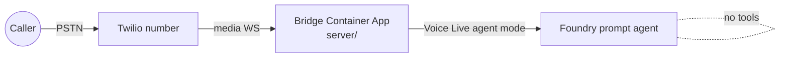
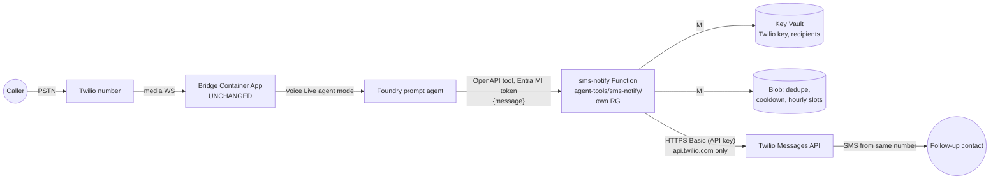

# SMS follow-up notification tool (`agent-tools/sms-notify/`): design spec

> **Status:** ACCEPTED rev 2.1, 2026-09-30, voice-agent-partner (Opus). The founder's answers of 2026-09-30 are applied: **D-062 and D-063 are ACCEPTED**, and Q-085 to Q-093 are all ANSWERED (STATUS.md §3). Rev 2.1 is the text landed in USMS00, after its Opus docs review (D-013). The changelog is §16.
> **Plan:** [2026-09-30-sms-notify-plan.md](../plans/2026-09-30-sms-notify-plan.md) (units USMS00 to USMS02, steps, rehearsal procedure, founder checklist, DoD). **Milestones:** [2026-09-30-sms-notify-milestones.md](../plans/2026-09-30-sms-notify-milestones.md).
> **Goal:** a founder demo on **Friday 2026-10-02**. Near the end of a call, the Foundry agent sends **one** SMS to a fixed follow-up contact, who can then call the caller back.
> **Shape:** a demo first, but built so it can later become the **Twilio SMS notifier adapter** of a future call-records and notifications service. That service's design is a **draft that is not in this repo**; its decision numbers D-060 and D-061 are provisional and are not recorded in DECISIONS.md. Nothing here depends on that draft being accepted. The adapter shape this tool must implement is copied in full into the plan (§2, P1), so the builder never needs the draft. That adapter is **not** built here as part of any call-records service.

---

## 1. Scope

**In scope**
- One HTTP tool operation, `send_follow_up_sms(message)`. The agent writes the whole text, in the six-line format the founder specified. That format lives **only** in the Foundry instruction snippet (§11), never in `agent-tools/` code, so the service stays generic. The service checks it, applies limits, and forwards it through Twilio Programmable SMS, from the existing Twilio number (a Canadian local number, SMS-capable), to the recipient(s) held in service config.
- A self-contained azd project under `agent-tools/sms-notify/` with its own `pyproject.toml`, lockfile, tests, `infra/` and `azure.yaml`, in its own resource group (D-053 pattern).

**Out of scope (do not build)**
- Any change to the bridge (`server/`), its infra, or its routing. Nothing imports from `server/`, and `server/` imports nothing from here.
- Inbound SMS, replies, delivery-status webhooks, templates, the call-records service, email, and multiple recipients per binding beyond a short fixed list (at most 3).
- Letting the agent choose the recipient. There is no `to` argument, ever.
- Outbound calling (TELEPHONY_BRIDGE_SPEC.md §7 stands).

**"After a call" in practice.** The agent can't act once the caller hangs up. So it calls the tool **near the end of the call**, after it has confirmed the details and before it says goodbye. The call is synchronous and takes about 1 s.

## 2. Architecture

**Before (today):**


**After (this spec):**

The bridge's own code and traffic are unchanged. The only new edges start at the Foundry agent.

## 3. Key decisions (each short, with the reason)

| # | Decision | Why |
| --- | --- | --- |
| K1 | **The agent writes the text. The service only checks and forwards it.** An optional fixed `SMS_PREFIX` (operational config, like `FALLBACK_MESSAGE`) may be prepended, and is empty by default | D-004: Foundry stays the only source of the agent's behavior. The service writes no content about the caller |
| K2 | **Recipients live only in a Key Vault secret** (`sms-recipients`: a JSON list in E.164 format). They never appear in the tool arguments, the OpenAPI document, the prompt, the repo, or logs (masked as `***1234`) | The model can't be talked into sending elsewhere, so there's no prompt-injection path to a new destination. The secret is also the destination allowlist |
| K3 | **Transport: OpenAPI attached directly** (recommended), with a framework-free core so an MCP facade can be added later without touching it | It's proven through today's bridge with no per-agent approval setting (UC01 E2, versus E4 for MCP; STATUS.md §2), and one ~1 s call fits inside the bridge's 15 s OpenAPI watchdog (E12). This choice **does not decide** calendar's D-059(a) |
| K4 | **A request with a valid token always gets HTTP 200** with `{ok, code, retry:false}`. Only a missing or invalid token gets `401` with an empty body | E10: on OpenAPI, a non-2xx fails the whole turn and the model never sees the body. Foundry always sends a valid token, so a 401 only ever reaches non-Foundry callers, or a misconfiguration that the rehearsal catches |
| K5 | **Deadline 5 s end to end**, measured from the request's arrival. Per-operation budgets: Twilio POST 3.5 s, Key Vault read 1.5 s (cached 5 min), JWKS fetch 1.5 s (cached), storage operations 0.5 s each. **Each operation's timeout is the smaller of its budget and the time left before the deadline.** If the deadline runs out before a recipient's POST is sent, that recipient counts as `send_failed` (nothing went out); if it runs out after the POST was sent, it counts as `send_unconfirmed`. A timed-out send is **never** retried | D-050's 15 s OpenAPI watchdog includes the model's own 1–4.5 s (E12), so the tool must stay well inside the remainder; this is the same reasoning as D-059(d) for calendar. Not retrying avoids duplicate texts |
| K6 | **Auth**: an Entra app `sms-notify-api` with app role `Sms.Send` and assignment required, plus an **in-code principal allowlist** on `oid` (`SMS_ALLOWED_PRINCIPALS`). The code checks the signature (RS256 against the tenant's JWKS, cached and refreshed on an unknown `kid`, at most once per 60 s; otherwise an unknown `kid` is a 401), `iss` (v1 and v2 forms for our `tid`), `aud` (the app ID URI or the bare app ID), `tid`, `exp`/`nbf` (60 s leeway) and the allowlist. It also checks the `roles` claim, but only when `SMS_REQUIRE_ROLE=true` (off at first). If the JWKS can't be fetched, the token can't be judged, so the request gets 200 `unavailable` (not 401) | E6: OpenAPI direct presents the Foundry **resource's** managed identity. E13: role changes take up to 24 h to reach Foundry tokens. So the allowlist is the control that works at once. `SMS_REQUIRE_ROLE` is turned on once `roles` has been seen on a Foundry token (as in UC09) |
| K7 | **Twilio credentials**: a Standard **API key** (SID + secret, not the account auth token) and the Account SID, held in the Key Vault secret `twilio-api` and read through the Function's managed identity over REST (calendar P5). The sender number is an app setting fed from the azd environment, never committed | No secret in the repo or in app settings. The API key can be revoked without rotating the account |
| K8 | **Twilio is called over raw HTTPS** (`httpx`) to a single hard-coded host, `https://api.twilio.com/2010-04-01/Accounts/{sid}/Messages.json`. There is no status callback URL | No SDK surface. There's no user-controlled URL, so there's no SSRF. No inbound webhook means no second attack surface |
| K9 | **Hosting**: Azure Functions Flex Consumption, Python 3.12, anonymous route with auth done in code (calendar P4). It gets its own RG `rg-sms-notify-<env>`, Key Vault, and storage account (the Functions storage account, container `sms-state`). The azd environment is `sms-<env>`, guarded by `AGENT_TOOL=sms-notify` (the D-042/P11 analogue; CLAUDE.md §10) | This mirrors the calendar pattern, costs almost nothing at demo volume, and keeps the bridge's infra untouched |
| K10 | **Region: East US 2, for the demo only** (Q-085, answered by the founder). It moves to Canada with the rest of the agent stack under Q-074 (Canada data residency) | Co-located with the Foundry resource. The move to Canada is a later redeploy of this self-contained azd project |
| K11 | **Cap of 480 characters, 8 lines** (raised from 320; see the budget below). The agent is told to aim for 320 or fewer. **Newlines are allowed**: CRLF and CR become LF, up to 8 lines, blank lines are dropped, and whitespace is collapsed *within* each line. Curly quotes, dashes, ellipses and the backtick become their ASCII equivalents so the text stays in the GSM-7 character set where it can. **The cap applies to the body as sent**, `SMS_PREFIX` + text, so a non-empty prefix shrinks the room for the text | The founder's format is one field per line, so a validator that strips newlines would break it. 320 characters is too tight for the worst case. Mapping punctuation to ASCII avoids a silent switch to UCS-2 encoding, which costs about 2.3 times as many segments |

**Length budget (K11).**
- **The labels are fixed at 64 characters:** `Name: ` (6), `Phone #: ` (9), `Purpose: ` (9), `Budget: ` (8), `Timeline: ` (10), `Meet preference: ` (17), plus 5 newlines.
- **A typical message is about 150 characters**, which is 1 segment.
- **A worst-case message is about 300 characters.** Each value at its worst: a name of 40 characters, a phone number of 15, a purpose of 15 (`Sell, Buy, Rent`), a budget of 25, a free-text timeline of 80, and a meeting preference of 38 (`Phone, Text, WhatsApp, Personal meetup`). With 16 more for a possible `SMS_PREFIX`, that comes to about 300.
- **So 320 characters gives no margin,** and a chatty timeline pushes the message past it. That would fail the send (`invalid_request`) in the middle of a demo. 480 characters gives about 60% headroom.

**The cost of 480 characters.** Twilio bills per segment.
- **In GSM-7** (letters, digits, newlines and most ASCII punctuation, including `#` and `$`), a message of up to 160 characters is 1 segment. The extension characters `{ } [ ] ~ ^ | \` and `€` are in GSM-7 but count as 2 characters each; the backtick is not in GSM-7, which is why normalization maps it. A longer one is billed at 153 characters per segment: 320 characters is 3 segments and 480 is 4.
- **In UCS-2,** if any character falls outside GSM-7 (an emoji, or an uncommon accented letter), a message of up to 70 characters is 1 segment and a longer one is billed at 67 per segment. 480 characters would then be 8 segments.
- **At demo volume, where the hourly cap is 6 sends, that's a few cents per text either way.** The service logs the encoding and the segment count so the cost is visible.

## 4. Tool contract

**OpenAPI 3.0 document** (`openapi/sms-notify.json`). The builder generates it and a contract test pins it:
- `servers[0].url`: `https://<function-host>/api` (filled in at deploy; not in the repo with a real host).
- One operation: `POST /v1/follow-up-sms`, `operationId: send_follow_up_sms`.
- Request body: `{ "message": string, minLength 1, maxLength 480 }`, `additionalProperties: false`. (`maxLength` bounds the message alone; the service then checks prefix + text against the same 480, K11. With the default empty prefix the two are identical.) **No recipient field and no other fields.** Unknown fields return `invalid_request`.
- Response `200`: `{ "ok": boolean, "code": string, "retry": false }`.
- Security: Foundry's managed-identity auth, audience `api://<sms-notify-api app id>`.

**Tool description.** This goes in the repo's OpenAPI document, so it stays **generic**: it contains no domain words and no message format. The founder attaches the document as it is. The six-line format comes only from the §11 instruction snippet.
> Sends one short text message to this business's follow-up contact so a team member can reach the caller. The recipient is fixed; you supply only the message text, in the format your instructions give. Use at most once per call, near the end, after the caller has confirmed their callback number and agreed to a follow-up. Plain text, one field per line allowed, no links, at most 480 characters (aim for 320 or fewer). Returns ok true or false. Never call it again in the same call, whatever the result.

**Result codes** (`ok` / `code`):

| ok | code | When |
| --- | --- | --- |
| true | `sent` | Twilio accepted the message for every recipient (HTTP 201) |
| true | `already_sent` | The same normalized text was **sent successfully** in the last 30 min (dedupe; §5 step 4) |
| false | `invalid_request` | Bad JSON, a missing or empty `message`, unknown fields, or over 480 characters (prefix + text) or over 8 lines after normalization |
| false | `content_rejected` | The text contains a link (§5 step 2), or is left empty after control characters are stripped |
| false | `rate_limited` | Inside the cooldown, the hourly cap is reached, or the same text was attempted in the last 30 min without a confirmed send (§5 step 4) |
| false | `forbidden` | A valid token whose `oid` isn't on the allowlist, or whose role is missing when `SMS_REQUIRE_ROLE=true` |
| false | `send_failed` | Nothing was sent: Twilio returned a definite error (4xx/5xx, reported with the Twilio error code, never the body), or the connection failed or the deadline ran out **before** the request was sent (K5) |
| false | `send_unconfirmed` | Twilio timed out or the connection dropped after the request was sent. It may have been delivered, and it isn't retried |
| false | `unavailable` | Key Vault, storage or the JWKS endpoint is unreachable, or config is missing or invalid. **It fails closed: nothing is sent** |

If several recipients are configured, the core sends to each one separately (plan P6). If Twilio accepts some but not all, or any recipient fails, the result is `ok:false` with the worst code of the per-recipient failures, in the order `send_unconfirmed` > `unavailable` > `send_failed`. The log line records each recipient's outcome (masked). The outcome written back to the dedupe blob (§5 step 4) is this final code, so it is `sent` only when every recipient was sent. On a partial multi-recipient send, the code describes the worst failed recipient, and other recipients may already have been sent (so "nothing is sent" in the table holds per recipient). The demo has one recipient.

## 5. Processing order (one request)

1. Validate the token (K6). If it's missing or invalid, return `401` with an empty body and stop. If the JWKS can't be fetched, return 200 `unavailable`. If the token is valid but its `oid` isn't allowlisted (or the role is missing when required), return 200 `forbidden`. Every later outcome is HTTP 200.
2. Parse the body against the schema, then normalize the text (K11):
   - NFKC;
   - CRLF and CR become LF;
   - strip C0/C1 control characters except LF, and bidi-override characters;
   - collapse whitespace within each line, and drop blank lines;
   - map curly quotes, dashes, ellipses and the backtick to ASCII.

   Then validate `SMS_PREFIX` (an app setting, not a secret): it must be a single line, with no newline, otherwise return `unavailable`. It is prepended directly to the first line. Then check the limits: at most 480 characters for `SMS_PREFIX` + text, and 8 lines. Reject links, meaning any `://`, `www.`, or a token ending in a common TLD from a short fixed list (for example `.com .net .org .ca .io .ly .co .me .info .biz .app .link .xyz .us`, case-insensitive). A bare dotted name (`J.Doe`) or an amount (`$1.5M`) must **not** be rejected.
3. Load the config and secrets. Key Vault values are cached for 5 min, and a failure returns `unavailable`. Validate the recipients: E.164 only, country code in `SMS_ALLOWED_COUNTRIES`, which is fixed to `CA` (Q-086: recipients are in Canada only), and at most 3.
4. **Dedupe:** create `sms-state/dedupe/<sha256(normalized text)>` if it doesn't exist (`If-None-Match: *`), with the body `{"at": <UTC time>, "outcome": "pending"}`. If a copy exists from less than `SMS_DEDUPE_MINUTES` (30) ago, nothing is sent: return `already_sent` (`ok:true`) **only if its recorded outcome is `sent`**, and `rate_limited` (`ok:false`) for any other recorded outcome (`pending`, or a failure). An older copy is replaced using compare-and-swap. After step 7, the outcome is written back to the blob (best-effort; if that write fails, the blob stays `pending`, which fails closed).
5. **Cooldown (the per-call backstop):** the blob `cooldown` holds the time of the last **claimed** send. It is stamped here, before sending, with `If-Match` compare-and-swap (or created with `If-None-Match: *` if it doesn't exist yet), and is not rolled back if the send later fails. If the stored time is less than `SMS_MIN_INTERVAL_SECONDS` ago (default 90), return `rate_limited` without stamping. A lost compare-and-swap race also returns `rate_limited`.
6. **Hourly cap:** claim the first free slot blob `rate/<UTC yyyymmddHH>/<n>`, for n from 1 to `SMS_MAX_PER_HOUR` (default 6). If none is free, return `rate_limited`. One slot covers one request, which sends to every configured recipient (at most 3).
7. Send one Twilio `POST` per recipient, one after another, as `SMS_PREFIX + text`, under the deadline (K5), and return the result code from the table above.
8. Write one log line (§8). Claims are **not** released after a failure. That fails closed and keeps the logic simple.

**State retention.** A storage lifecycle rule deletes blobs under `sms-state/dedupe/` and `sms-state/rate/` one day after their last change (lifecycle rules work in whole days, and Azure runs the policy about once a day, so an action can take up to another day). So a caller-derived hash is used for 30 min of dedupe and is gone within about two days. The single `cooldown` blob holds only a timestamp.

**Why the dedupe outcome is recorded.** Without it, a request that claimed the dedupe blob and then stopped at the cooldown, the hourly cap, or a Twilio failure would make a later identical request report `already_sent` with `ok:true` although nothing was ever sent. Recording the outcome keeps `ok:true` honest while still never sending the same text twice in the window.

**Per-call limit, stated honestly.** The service can't see which call it's serving: Foundry passes it no call ID, and adding one would mean changing the bridge, which is out of scope. "One SMS per call" is enforced by (a) the agent's instructions, (b) the 90 s cooldown, which matches the pilot's one-call-at-a-time scope, (c) dedupe, and (d) the hourly cap. The founder accepted this (Q-093).

## 6. Code layout (for USMS01)

```
agent-tools/sms-notify/
  pyproject.toml  uv.lock  azure.yaml  README.md (config table)  function_app.py (one anonymous route)
  sms_notify/
    core/         messages.py (normalize/validate), limits.py (dedupe/cooldown/hourly via a StateStore port),
                  service.py (notify(): the framework-free core), errors.py
    ports.py      StateStore, SecretSource, Clock, and the Notifier-shaped types (plan §2, P1):
                  NotifierConfig, OutboundMessage, NotifierCapabilities, SendResult, Notifier
    adapters/     twilio_sms.py (TwilioSmsNotifier: formats {"text_short"}, max_body_chars 480,
                  native_idempotency False, leaves_boundary True, residency "global"),
                  blob_state.py, keyvault_secrets.py (REST, httpx)
    http/         dispatcher.py (framework-free; JWT auth; always-200 envelope), auth.py
  openapi/sms-notify.json
  infra/          main.bicep (RG, Flex app, storage, KV, RBAC, app settings), main.parameters.json
  tests/          see §9
```
`TwilioSmsNotifier` implements the `Notifier` protocol exactly as the plan's P1 defines it (copied from the call-records draft, which is not in this repo). A future call-records track can then lift the adapter instead of rewriting it. How it would be shared (copied or imported) is that track's decision, not this spec's.

## 7. Configuration (app settings, from the azd environment; no values in the repo)

| Setting | Example (fictional) | Notes |
| --- | --- | --- |
| `SMS_FROM_NUMBER` | `+1XXX5550100` | The real number exists only in the azd env |
| `SMS_ALLOWED_COUNTRIES` | `CA` | Recipients are in Canada only (Q-086) |
| `SMS_MAX_CHARS` / `SMS_MAX_LINES` | `480` / `8` | K11. The OpenAPI `maxLength` must match |
| `SMS_ALLOWED_PRINCIPALS` | `<oid>` | The Foundry resource MI's `oid` (E6) |
| `SMS_AUTH_AUDIENCE` / `SMS_AUTH_TENANT_ID` | `api://…` / `<tid>` | |
| `SMS_REQUIRE_ROLE` | `false` | Set to `true` once `roles` has been seen on a Foundry token |
| `SMS_MIN_INTERVAL_SECONDS` / `SMS_MAX_PER_HOUR` / `SMS_DEDUPE_MINUTES` | `90` / `6` / `30` | |
| `SMS_PREFIX` | `""` | Optional fixed operational prefix |
| `KEY_VAULT_URI` / `STATE_BLOB_URL` | | Accessed through the managed identity |
| KV secret `twilio-api` | `{"account_sid","api_key_sid","api_key_secret"}` | Set by the founder |
| KV secret `sms-recipients` | `{"recipients":["+1XXX5550199"]}` | Set by the founder |

## 8. Security and privacy checks (for the `cso` review, and in the DoD)

- **SSRF:** none. There's one hard-coded Twilio host and one Key Vault and storage endpoint from config. No URL comes from a request.
- **Injection:** `message` is untrusted text bound for a human. It's normalized, length-capped, stripped of links (anti-phishing), and never interpreted, templated, logged or echoed back. It can't change the recipient, the sender or any headers, and it's sent as a single form field.
- **Abuse:** the recipient is fixed, and there's the cooldown, the hourly cap, dedupe, and Twilio Messaging **Geo Permissions** limited to the allowed countries (founder checklist, plan §6). The worst case for a compromised or misbehaving agent is at most 6 sends an hour, each to the same fixed recipient list (at most 3 numbers we already know; one in the demo).
- **Identity blast radius:** the OpenAPI-direct identity is resource-wide (E6), so any agent on the Foundry resource that attaches this tool can call it. That's accepted for the demo because the recipient is fixed and the cap applies. Moving to MCP later narrows it to the project.
- **Logging:** one line per request: request ID, `code`, recipient(s) masked `***1234`, Twilio message SID, character count, encoding (GSM-7 or UCS-2), segment count, and latency. **The message body, the caller's details and full numbers are never logged.** A test (caplog) enforces this. Twilio error bodies aren't logged either, only the numeric Twilio error code.
- **Secrets:** Key Vault only, read through the managed identity. There's no `.env` with values, and `local.settings.json` is git-ignored.
- **Data leaving the boundary:** the text passes through Twilio (a US processor, which keeps message bodies in its logs) and the carriers to the recipient's phone. That's covered by D-063 and Q-092.

## 9. Test plan (USMS01; all offline except the opt-in marker)

- **Unit, core:**
  - Normalization: NFKC, controls, bidi, and CRLF/CR to LF. Newlines are kept, whitespace is collapsed within lines, and blank lines are dropped. Curly quotes, dashes and the backtick become ASCII.
  - Boundaries: 480 and 481 characters, and 8 and 9 lines; with a non-empty `SMS_PREFIX`, the boundary moves down by the prefix length; a prefix containing a newline gives `unavailable`.
  - Link rejection: `https://`, `www.`, `example.com` and `x.ca` are rejected. `J.Doe`, `$1.5M` and `a.m.` pass.
  - An empty result after stripping is rejected.
  - A generic six-line fixture with made-up labels passes unchanged. The founder's real labels are **not** used in tests (genericity).
  - A GSM-7 vs UCS-2 segment-count helper, tested at 160, 161, 306, 307, 70 and 71 characters, plus a GSM-7 extension-character case (`{` or `€` counting as 2).
- **Unit, limits** (with `FakeStateStore` and `FakeClock`): the deadline arithmetic (each operation gets the smaller of its budget and the time left; the deadline expiring before or after a POST gives `send_failed` or `send_unconfirmed`); per-recipient sending with partial success across two recipients giving `ok:false` with the worst code (P6); the cooldown stamped at claim time and not rolled back; dedupe within and after the window; a duplicate after a `sent` outcome gives `already_sent`, and a duplicate after a `pending` or failed outcome gives `rate_limited`, with nothing sent in either case; cooldown boundary; the hourly cap on its 6th and 7th sends; hour rollover; concurrent claims (two tasks, one wins); a storage failure gives `unavailable` and nothing is sent.
- **Unit, Twilio adapter** (with `FakeTwilioTransport` / `httpx.MockTransport`): the exact URL, host and form fields (`To`, `From`, `Body`); Basic auth uses the API key; 201 gives `sent`; 400 or 500 gives `send_failed` with only the error code; a timeout or dropped connection after sending raises `NotifierUnavailable(maybe_sent=True)` (→ `send_unconfirmed`) with **no retry**; a connection failure before sending raises `NotifierUnavailable(maybe_sent=False)` (→ `send_failed`); `validate_config` rejects a `NotifierConfig` with other than exactly one recipient (P6).
- **Unit, auth and dispatcher:** locally minted RS256 keys and JWKS. Good token (with `aud` as the app ID URI and as the bare app ID); bad signature, `aud`, `iss`, `tid`, expired or not-yet-valid beyond the 60 s leeway all give 401. An unknown `kid` triggers one JWKS refresh, and a second unknown `kid` within 60 s gets 401 with no fetch; JWKS unreachable gives 200 `unavailable`. A valid token that isn't allowlisted gives 200 `forbidden`. `SMS_REQUIRE_ROLE` on and off. **Every non-401 path returns HTTP 200** (a parametrized matrix). Unknown fields give `invalid_request`. A `to` or `recipient` field is rejected.
- **Config:** a non-E.164 recipient, a disallowed country, more than 3 recipients, or a missing setting all give `unavailable` at request time. The error message never includes the number.
- **Contract:** the OpenAPI document has exactly one operation, only a `message` property, `additionalProperties:false`, and a `maxLength` of 480 that equals `SMS_MAX_CHARS`'s default. Its description passes the G2 denylist.
- **Guards:** G1, no import of `server` anywhere (AST scan). G2, the genericity denylist: a regex for any phone number outside `555-01xx`, plus a hashed-name denylist following calendar P6's format, in `agent-tools/sms-notify/tests/genericity_denylist.txt` (sms-notify owns its own copy, because calendar's G2 hasn't merged yet; CLAUDE.md §7 exempts both files). G3, a logging test (caplog) showing no body, no full number, and no secret.
- **Opt-in `-m live_twilio`:** one real send, of a fictional body with no personal data, to the configured recipient, using the Key Vault secrets. Run only in USMS02 and by the founder's choice. It's excluded by default in `pyproject` (`addopts = -m "not live_twilio"`).
- **Whole suite (CLAUDE.md §5 step 5, extended in USMS00):** the bridge suite, the calendar suite if UC02a has merged, and `cd agent-tools/sms-notify && python -m uv run pytest -q`.

## 10. Units, sequencing and plan

Moved to the [plan](../plans/2026-09-30-sms-notify-plan.md) §3 (units USMS00 to USMS02, steps, prerequisites, timeline). In short: USMS00 lands this spec (docs); USMS01 builds and provisions nothing (Opus); USMS02 deploys and rehearses (branchless ops, persistent resources under D-062). The USMS units run before calendar UC02a (Q-088).

## 11. Instruction snippet (lives in Foundry, not the repo)

The rehearsal and production-attach procedure that uses this snippet is in the plan, §4 (USMS02).

**Instruction snippet for the founder to paste.** It lives in Foundry, not the repo's code. This is the **only** place the founder's message format appears; the agent writes the content and decides whether to send (D-004).

> **Follow-up text message.** Near the end of the call, before you say goodbye:
> 1. Tell the caller that their details will be passed to a team member by text message so someone can follow up, and ask if that's okay. If they decline, do not send anything.
> 2. Read their callback number back to them digit by digit and get their confirmation. If you can't confirm it, do not send.
> 3. Call `send_follow_up_sms` **exactly once**, with a message of exactly these six lines, in this order:
>
> ```
> Name: <caller's name>
> Phone #: <confirmed callback number>
> Purpose: <Sell, Buy or Rent, or a combination, whichever fits what the caller said>
> Budget: <amount, e.g. $XXX>
> Timeline: <Now, 3 months, 6 months, or the period the caller mentioned>
> Meet preference: <Phone, Text, WhatsApp or Personal meetup>
> ```
>
> 4. For any field the caller did not give, write `not given`. Never guess or invent a value. Use only what the caller said.
> 5. Keep the whole message under 320 characters. Keep each value short, with no links, no emoji and no other personal details.
> 6. Never call the tool more than once per call, even if it fails or times out. Don't mention the tool to the caller. Whatever the result, just tell the caller a team member will follow up. If the tool fails, say nothing about errors or technical problems.

**Sample message** (fictional values; 117 characters, 1 segment in GSM-7):
```
Name: Jordan Example
Phone #: +1 416 555 0142
Purpose: Buy
Budget: $650,000
Timeline: 3 months
Meet preference: Phone
```

## 12. Governance

The authoritative text of both decisions is in [DECISIONS.md](../../DECISIONS.md); this is a summary.

**D-062 · 2026-09-30 · ACCEPTED · Partner decision under D-030, plus a founder re-sequencing (Q-088, founder direct instruction, 2026-09-30): `agent-tools/sms-notify/`, a minimal SMS follow-up tool for the 2026-10-02 demo.**
It's a sibling self-contained azd project under `agent-tools/` (the D-053 pattern: its own lockfile, tests, `infra/`, `azure.yaml` and RG, and no imports to or from `server/`).
- It's attached as an **OpenAPI-direct** tool, with a framework-free core so it can be swapped to MCP later. This doesn't decide calendar's D-059(a).
- Every request with a valid token returns HTTP 200 (E10).
- Recipients are held only in Key Vault.
- Auth is an Entra app role plus an in-code `oid` allowlist, with the role check turned on after the 24 h lag (E13).
- Units: USMS00 (docs), USMS01 (build, Opus), USMS02 (branchless deploy and rehearsal).
- **Carve-out from D-053:** USMS02's Azure resources are **persistent**, not throwaway. Its resource list is still committed first on its status branch, each item founder-approved (Q-091). Its azd environment is `sms-<env>`, guarded by `AGENT_TOOL=sms-notify`, under D-042's rules applied by analogy.
- **Re-sequencing (founder, Q-088):** the USMS units run before calendar UC02a.
- **Message format:** the founder's six-line format lives only in the agent's Foundry instructions (§11), not in code. The service is generic: a cap of 480 characters and 8 lines, with newlines allowed (K11).
- **Region:** East US 2 for the demo only (Q-085). It moves to Canada under Q-074.
- The adapter follows the `Notifier` shape copied into the plan (P1), so a future call-records track can lift it.
- What happens to the persistent resources after the demo is open as Q-094.

**D-063 · 2026-09-30 · ACCEPTED (founder-confirmed, Q-087; source: founder direct instruction, 2026-09-30): narrow TELEPHONY_BRIDGE_SPEC.md §7 lifts for `agent-tools/sms-notify/` only.**
1. **"Calendar or booking tools, or any OpenAPI tool wiring"**: the OpenAPI tool wiring part is lifted for this one tool, attached to Foundry agents. This extends D-052 item 1, which covered calendar only. The bridge still wires no tools.
2. **"Storing transcripts or caller data anywhere outside Foundry traces and logs"**: lifted to allow **sending**, not storing in our systems, an agent-written text to the fixed follow-up contact.
   - **The data set:** whatever the agent puts in the text. The instructions limit it to six fields: the caller's name, confirmed callback number, purpose, budget, timeline, and meeting preference. A field the caller didn't give is written as `not given`. Budget is personal financial information, and is covered by this lift.
   - **Where it goes:** Twilio (the processor; it keeps message bodies in its logs), the carriers, and the recipient's handset.
   - **Our systems store only:** a SHA-256 hash of the text with its send outcome, used for 30 min of dedupe and deleted within about two days by a storage lifecycle rule (§5), plus timestamps. There's no body, no number and no transcript.
   - **Responsibility:** the business receiving the text, for retention and follow-up. The caller is told first and agrees (Q-089), and the agent sends nothing if they decline.

   Every other §7 item stands, including outbound calling. An SMS is not a call.

## 13. Open questions

Numbers: Q-075 and Q-076 are UC01's (already on `main`); Q-077 to Q-084 are reserved for the unlanded call-records draft. The authoritative rows are in STATUS.md §3.

**Q-085 to Q-093 were answered by the founder directly, in chat, on 2026-09-30.** Q-094 was raised afterwards, in USMS00's docs review, and is open.

| Q | Question | Owner | Blocks | Status and answer |
| --- | --- | --- | --- | --- |
| Q-085 | Region for the demo service (under Q-074) | Founder | USMS01 step 1, USMS02 | **ANSWERED.** East US 2, for the demo only. It moves to Canada later under Q-074 |
| Q-086 | Where is the recipient: Canada or the US? | Founder | USMS02 | **ANSWERED.** Canada only (`SMS_ALLOWED_COUNTRIES=CA`, Geo Permissions set to Canada). The US A2P 10DLC and carrier-filtering risk doesn't apply. (Note: if a US recipient is ever added, a Canadian long code can't be registered for 10DLC, so delivery there would be best-effort) |
| Q-087 | Confirm D-063's two narrow §7 lifts | Founder | USMS00 | **ANSWERED: YES.** D-063 is ACCEPTED |
| Q-088 | Re-sequence USMS00 to USMS02 ahead of calendar UC02a | Founder | USMS00 | **ANSWERED: YES** |
| Q-089 | Caller notice: does the agent say their details will be passed on by text? | Founder (privacy) | USMS02 | **ANSWERED: YES.** It's step 1 of the §11 snippet, and the agent sends nothing if the caller declines. A privacy review is still advised before real callers |
| Q-090 | When to attach to production, and whether to keep it attached after the demo (D-049) | Founder (risk) | USMS02 step 3 | **ANSWERED** (founder accepted the recommendation). Attach 30 to 60 min before the demo, after the copy-agent checks pass. **Detach after the demo** |
| Q-091 | Spending and resource approval (Function, storage, Key Vault, SMS charges); paid or trial Twilio account | Founder | USMS02 | **ANSWERED: YES.** The account is paid and the founder has created an API key. **No values are recorded here** |
| Q-092 | Twilio keeps message bodies in its logs | Founder | USMS02 | **ANSWERED: YES** (accepted for the demo). Before real callers, look at deleting message records after delivery through the API (to be verified, not assumed) |
| Q-093 | Accept "one SMS per call" as instructions + 90 s cooldown + dedupe + hourly cap | Partner / founder | USMS01 | **ANSWERED: YES.** A true per-call limit would need a future bridge unit |
| Q-094 | After the demo, what happens to USMS02's persistent resources and credentials: keep them (allowlist unchanged, so any agent on the Foundry resource that attaches the tool could call it, E6), tear them down, revoke the Twilio API key, or redeploy in Canada (Q-074)? Any later infra change needs its own unit, named in the plan or a new D-NNN (CLAUDE.md §10) | Founder | Nothing before the demo; decide within a week after it | **OPEN** (raised in USMS00's docs review) |

## 14. Founder checklist

Moved to the [plan](../plans/2026-09-30-sms-notify-plan.md) §6.

## 15. Definition of Done

Moved to the [plan](../plans/2026-09-30-sms-notify-plan.md) §5 and the [milestone doc](../plans/2026-09-30-sms-notify-milestones.md).

## 16. Changelog

- **rev 2.1 (2026-09-30, USMS00, landing edits):**
  - The plan (units, USMS01 steps, rehearsal procedure, founder checklist, DoD) is split out to `docs/superpowers/plans/2026-09-30-sms-notify-plan.md`, with a milestone doc (D-015). §10, §14 and §15 now point there; §11 keeps only the snippet and sample.
  - References to the unlanded call-records draft no longer point at a scratchpad path. Its `Notifier` shape is copied into the plan (P1), so USMS01 does not depend on a document outside the repo. D-060 and D-061 are named as provisional, not relied on.
  - The Canada move is tied to Q-074 (on `main`), not to the draft's Q-084. §13's numbering note is corrected: Q-075 and Q-076 already belong to UC01.
  - Dedupe now records the send outcome, so a duplicate returns `already_sent` (`ok:true`) only after a confirmed send, and `rate_limited` otherwise (§4, §5 step 4, §9). Before this, a request stopped by the cooldown or cap, or a failed send, would have made a later identical request report `ok:true` with nothing sent.
  - Partial multi-recipient success is defined (`ok:false`, worst code). The abuse bound now counts sends, each to the fixed recipient list.
  - The G2 denylist file path is named, matching the CLAUDE.md §7 exemption added in USMS00.
  - **From the USMS00 Opus docs review, round 1:** per-recipient sending moved into the core (plan P6), since one `send` can't report mixed outcomes; the 5 s deadline now shares out the remaining time and defines `send_failed` versus `send_unconfirmed` on expiry (K5); JWKS caching, `kid` refresh, 60 s leeway, both `aud` forms, and JWKS-unreachable → 200 `unavailable` (K6, §5 step 1); a storage lifecycle rule deletes dedupe and rate blobs within about a day (§5, D-063 wording); the 480 cap covers prefix + text, and the prefix is single-line (K11, §4, §5); the cooldown is stamped at claim time (§5 step 5); `send_failed` covers a failure before sending; GSM-7 extension characters and the backtick; the K5 reference to calendar's deadline replaced by D-059(d)'s reasoning; the snippet's six lines put in a code block so they render line by line; Q-094 (post-demo lifecycle) raised.
  - **From round 2:** the full worst-code order (`send_unconfirmed` > `unavailable` > `send_failed`), with the dedupe outcome set to that final code; `SMS_PREFIX` validated in step 2, before the length check; retention stated as about two days (lifecycle policy run timing); the unknown-`kid` refresh throttled to once per 60 s; Q-094's timing aligned; the plan names a USMS02b contingency for a pre-demo code fix.
- **rev 2 (2026-09-30):** applies the founder's answers from 2026-09-30.
  - Q-085 to Q-093 are all ANSWERED. D-062 and D-063 are ACCEPTED.
  - Adds the founder's six-line message format. It lives only in the §11 snippet, and the OpenAPI description stays generic.
  - K11: the cap goes from 320 to 480 characters and 8 lines, because the worst-case template is about 300 characters and 320 left no margin. Newlines are allowed, and punctuation is mapped to ASCII to stay in GSM-7. The segment cost is stated.
  - The link check is narrowed to a short TLD list, so `J.Doe` and `$1.5M` pass.
  - The recipient is Canada-only.
  - The caller-consent step is added to the snippet.
  - Q-090 is answered (attach 30 to 60 min before the demo, then detach) and folded into §11, §14 and §15.
- **rev 1 (2026-09-30):** first draft.
